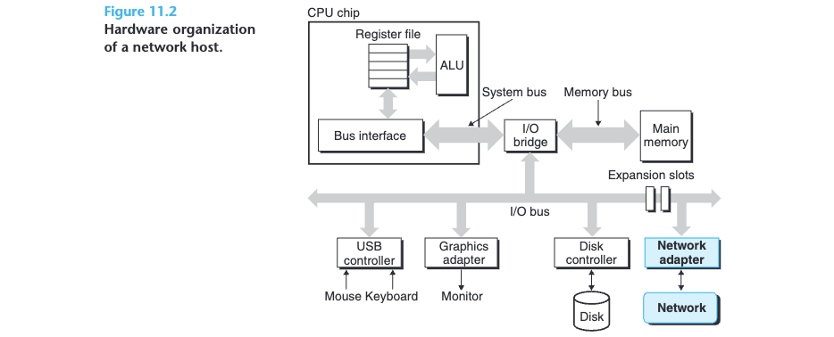
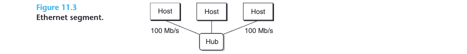
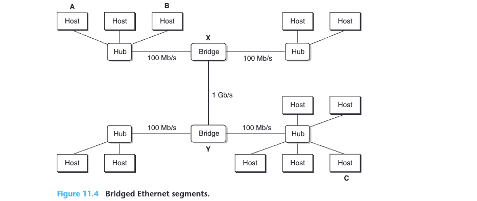
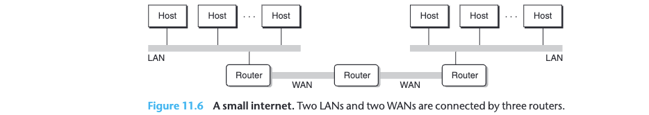
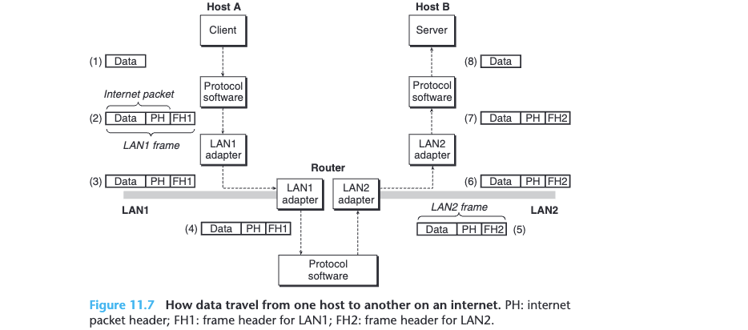
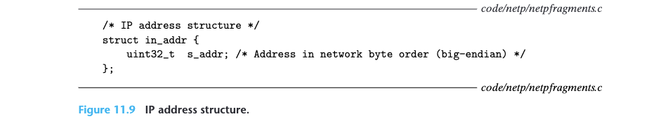
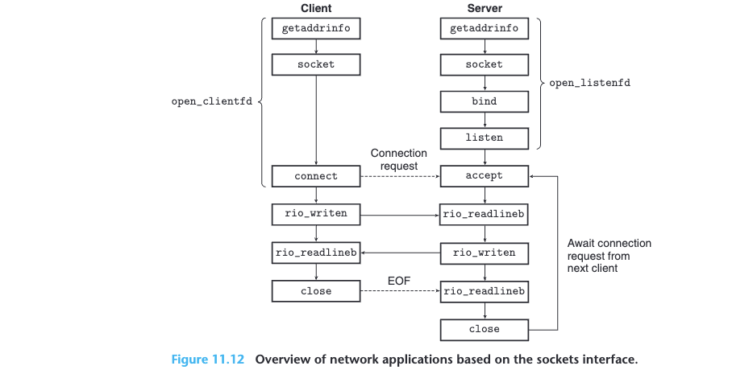
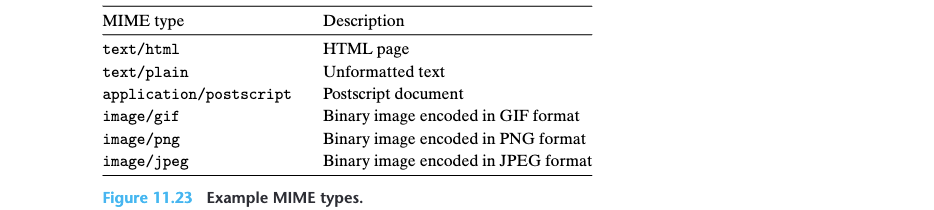

## 11.1 The Client-Server Programming Model

Every network application is based on the *client-server model*. A server manages some *resource*, and it provides some *service* for its clients by manipulating that resource. 

The fundamental operation in the client-server model is the transaction (**Figure 11.1**). A client-server transaction consists of four steps:

1. When a client needs service, it initiates a transaction by sending a *request* to the server.
2. The server receives the request, interprets it, and manipulates its resources in the appropriate way.
3. The server sends a response to the client and then waits for the next request.
4. The client receives the response and manipulates it.


## 11.2 Networks

To a host, a network is just another I/O device that serves as a source and sink for data, as shown in **Figure 11.2**.



An adapter plugged into an expansion slot on the I/O bus provides the physical interface to the network. Data received from the network are copied from the adapter across the I/O and memory buses into memory, typically by a DMA transfer. Similarly, data can also be copied from memory to the network.

Physically, a network is a hierarchical system that is organized by geographical proximity. At the lowest level is a LAN (local area network) that spans a building or a campus. The most popular LAN technology by far is *Ethernet*, which was developed in the mid-1970s at Xerox PARC. Ethernet has proven to be remarkably resilient, evolving from 3 Mb/s to 10 Gb/s.

An *Ethernet segment* consists of some wires (usually twisted pairs of wires) and a small box called a *hub*, as shown in **Figure 11.3**. Ethernet segments typically span small areas, such as a room or a floor in a building. Each wire has the same maximum bit bandwidth, typically 100 Mb/s or 1 Gb/s. One end is attached to an adapter on a host, and the other end is attached to a port on the hub. A hub slavishly copies every bit that it receives on each port to every other port. Thus, every host sees every bit.



Multiple Ethernet segments can be connected into larger LANs, called *bridged Ethernets*, using a set of wires and small boxes called *bridges*, as shown in **Figure 11.4**. Bridged Ethernets can span entire buildings or campuses. In a bridged Ethernet, some wires connect bridges to bridges, and others connect bridges to hubs. The bandwidths of the wires can be different. In our example, the bridge–bridge wire has a 1 Gb/s bandwidth, while the four hub–bridge wires have bandwidths of 100 Mb/s.



At a higher level in the hierarchy, multiple incompatible LANs can be connected by specialized computers called *routers* to form an internet (interconnected network). Each router has an adapter (port) for each network that it is connected to. Routers can also connect high-speed point-to-point phone connections, which are examples of networks known as WANs (wide area networks), so called because they span larger geographical areas than LANs. In general, routers can be used to build internets from arbitrary collections of LANs and WANs. For ex- ample, **Figure 11.6** shows an example internet with a pair of LANs and WANs connected by three routers.



The crucial property of an internet is that it can consist of different LANs and WANs with radically different and incompatible technologies. Each host is physically connected to every other host, but how is it possible for some *source host* to send data bits to another destination host across all of these incompatible networks?

The solution is a layer of *protocol software* running on each host and router that smoothes out the differences between the different networks. This software implements a *protocol* that governs how hosts and routers cooperate in order to transfer data. The protocol must provide two basic capabilities:
* *Naming scheme*. Different LAN technologies have different and incompatible ways of assigning addresses to hosts. The internet protocol smoothes these differences by defining a uniform format for host addresses. Each host is then assigned at least one of these *internet addresses* that uniquely identifies it.
* *Delivery mechanism*. Different networking technologies have different and incompatible ways of encoding bits on wires and of packaging these bits into frames. The internet protocol smoothes these differences by defining a uniform way to bundle up data bits into discrete chunks called *packets*. A packet consists of a *header*, which contains the packet size and addresses of the source and destination hosts, and a *payload*, which contains data bits sent from the source host.



**Figure 11.7** shows an example of how hosts and routers use the internet protocol to transfer data across incompatible LANs. The example internet consists of two LANs connected by a router. A client running on host A, which is attached to LAN1, sends a sequence of data bytes to a server running on host B, which is attached to LAN2. There are eight basic steps:

1. The client on host A invokes a system call that copies the data from the client’s virtual address space into a kernel buffer.

2. The protocol software on host A creates a LAN1 frame by appending an internet header and a LAN1 frame header to the data. The internet header is addressed to internet host B. The LAN1 frame header is addressed to the router. It then passes the frame to the adapter. Notice that the payload of the LAN1 frame is an internet packet, whose payload is the actual user data. This kind of encapsulation is one of the fundamental insights of internetworking.

3. The LAN1 adapter copies the frame to the network.

4. When the frame reaches the router, the router’s LAN1 adapter reads it from the wire and passes it to the protocol software.

5. The router fetches the destination internet address from the internet packet header and uses this as an index into a routing table to determine where to forward the packet, which in this case is LAN2. The router then strips off the old LAN1 frame header, prepends a new LAN2 frame header addressed to host B, and passes the resulting frame to the adapter.

6. The router’s LAN2 adapter copies the frame to the network.

7. When the frame reaches host B, its adapter reads the frame from the wire and passes it to the protocol software.

8. Finally, the protocol software on host B strips off the packet header and frame header. The protocol software will eventually copy the resulting data into the server’s virtual address space when the server invokes a system call that reads the data.

## 11.3 The Global IP Internet

The global IP Internet is the most famous and successful implementation of an internet. It has existed in one form or another since 1969. While the internal architecture of the Internet is complex and constantly changing, the organization of client-server applications has remained remarkably stable since the early 1980s. **Figure 11.8** shows the basic hardware and software organization of an Internet client-server application.

Each Internet host runs software that implements the *TCP/IP* protocol (*Transmission Control Protocol/Internet Protocol*), which is supported by almost every modern computer system. Internet clients and servers communicate using a mix of *sockets interface functions* and Unix I/O functions. The sockets functions are typically implemented as system calls that trap into the kernel and call various kernel-mode functions in TCP/IP.

TCP/IP is actually a family of protocols, each of which contributes different capabilities. For example, IP provides the basic naming scheme and a delivery mechanism that can send packets, known as datagrams, from one Internet host to any other host. The IP mechanism is unreliable in the sense that it makes no effort to recover if datagrams are lost or duplicated in the network. UDP (Unreliable Datagram Protocol) extends IP slightly, so that datagrams can be transferred from process to process, rather than host to host. TCP is a complex protocol that builds on IP to provide reliable full duplex (bidirectional) connections between processes.

From a programmer’s perspective, we can think of the Internet as a worldwide collection of hosts with the following properties:

* The set of hosts is mapped to a set of 32-bit *IP addresses*.
* The set of IP addresses is mapped to a set of identifiers called *Internet domain names*.
* A process on one Internet host can communicate with a process on any other Internet host over a *connection*.

### 11.3.1 IP Addresses

An IP address is an unsigned 32-bit integer. Network programs store IP addresses in the *IP address structure* shown in **Figure 11.9**.

Storing a scalar address in a structure is an unfortunate artifact from the early implementations of the sockets interface. It would make more sense to define a scalar type for IP addresses, but it is too late to change now because of the enormous installed base of applications.



Because Internet hosts can have different host byte orders, TCP/IP defines a uniform *network byte order* (big-endian byte order) for any integer data item, such as an IP address, that is carried across the network in a packet header. Addresses in IP address structures are always stored in (big-endian) network byte order, even if the host byte order is little-endian. Unix provides the following functions for converting between network and host byte order.

```c
#include <arpa/inet.h>
uint32_t htonl(uint32_t hostlong);
uint16_t htons(uint16_t hostshort);
																			Returns: value in network byte order
uint32_t ntohl(uint32_t netlong);
uint16_t ntohs(unit16_t netshort);
																			Returns: value in host byte order
```

Application programs can convert back and forth between IP addresses and dotted-decimal strings using the functions `inet_pton` and `inet_ntop`.

```c
#include <arpa/inet.h>
int inet_pton(AF_INET, const char *src, void *dst);
																			Returns: 1 if OK, 0 if src is invalid dotted decimal, −1 on error
const char *inet_ntop(AF_INET, const void *src, char *dst, socklen_t size);
																			Returns: pointer to a dotted-decimal string if OK, NULL on error
```

In these function names, the “n” stands for *network* and the “p” stands for *presentation*. They can manipulate either 32-bit IPv4 addresses (`AF_INET`), as shown here, or 128-bit IPv6 addresses (`AF_INET6`), which we do not cover.

### 11.3.2 Internet Domain Names

read the book

### 11.3.3 Internet Connections

A *socket* is an end point of a connection. Each socket has a corresponding *socket address* that consists of an Internet address and a 16-bit integer *port* and is denoted by the notation `address:port`.

A connection is uniquely identified by the socket addresses of its two end points. This pair of socket addresses is known as a *socket pair* and is denoted by the tuple *(cliaddr:cliport, servaddr:servport)* , where *cliaddr* is the client’s IP address, *cliport* is the client’s port, *servaddr* is the server’s IP address, and *servport* is the server’s port.

## 11.4 The Sockets Interface

The *sockets interface* is a set of functions that are used in conjunction with the Unix I/O functions to build network applications. **Figure 11.12** gives an overview of the sockets interface in the context of a typical client-server transaction.



read the book for the rest

## 11.5 Web Servers

### 11.5.2 Web Content



To Web clients and servers, content is a sequence of bytes with an associated *MIME (multipurpose internet mail extensions)* type. **Figure 11.23** shows some common MIME types.

Web servers provide content to clients in two different ways:

* Fetch a disk file and return its contents to the client. The disk file is known as *static content* and the process of returning the file to the client is known as *serving static content*.
* Run an executable file and return its output to the client. The output produced by the executable at run time is known as *dynamic content*, and the process of running the program and returning its output to the client is known as *serving dynamic content*.

read the book for the rest

## Note

```c
int getnameinfo(const struct sockaddr *restrict addr, socklen_t addrlen,
                       char host[_Nullable restrict .hostlen],
                       socklen_t hostlen,
                       char serv[_Nullable restrict .servlen],
                       socklen_t servlen,
                       int flags);

struct sockaddr {
   sa_family_t     sa_family;      /* Address family */
   char            sa_data[];      /* Socket address */
};

struct sockaddr_storage {
   sa_family_t     ss_family;      /* Address family */
};
```

是不是觉得有点奇怪，为什么不用sockaddr，而是使用sockaddr_storage？跑一下下面的代码吧。

```c
#include <sys/types.h>
#include <sys/socket.h>
#include <netdb.h>
#include <stdio.h>


int main () {
    struct sockaddr sa;
    struct sockaddr_storage sas;
    printf("size of sockaddr: %d\n", sizeof(sa));
    printf("size of sockaddr_storage: %d\n", sizeof(sas));
}
```

