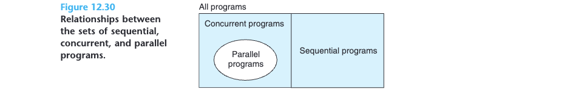

# 12 Concurrent Programming

Modern operating systems provide three basic approaches for building concurrent programs:

* *Processes*. With this approach, each logical control flow is a process that is scheduled and maintained by the kernel. Since processes have separate virtual address spaces, flows that want to communicate with each other must use some kind of explicit *interprocess communication (IPC)* mechanism.
* *I/O multiplexing*.This is a form of concurrent programming where applications explicitly schedule their own logical flows in the context of a single process. Logical flows are modeled as state machines that the main program explicitly transitions from state to state as a result of data arriving on file descriptors. Since the program is a single process, all flows share the same address space.
* *Threads*. Threads are logical flows that run in the context of a single process and are scheduled by the kernel. You can think of threads as a hybrid of the other two approaches, scheduled by the kernel like process flows and sharing the same virtual address space like I/O multiplexing flows.

## 12.1 Concurrent Programming with Processes

the connected descriptors in the parent and child each point to the same file table entry, it is crucial for the parent to close its copy of the connected descriptor. Otherwise, the file table entry for connected descriptor will never be released, and the resulting memory leak will eventually consume the available memory and crash the system.

### 12.1.1 A Concurrent Server Based on Processes

```c
#include "csapp.h"
void echo(int connfd);

void sigchld_handler(int sig)
{
  while (waitpid(-1, 0, WNOHANG) > 0)
    ;
  return;
}

int main(int argc, char **argv)
{
  int listenfd, connfd;
  socklen_t clientlen;
  struct sockaddr_storage clientaddr;

  if (argc != 2) {
    fprintf(stderr, "usage: %s <port>\n", argv[0]);
    exit(0);
  }

  Signal(SIGCHLD, sigchld_handler);
  listenfd = Open_listenfd(argv[1]);
  while (1) {
    clientlen = sizeof(struct sockaddr_storage);
    connfd = Accept(listenfd, (SA *) &clientaddr, &clientlen);
    if (Fork() == 0) {
      Close(listenfd); /* Child closes its listening socket */
      echo(connfd); /* Child services client */
      Close(connfd); /* Child closes connection with client */
      exit(0); /* Child exits */
    }
    Close(connfd); /* Parent closes connected socket (important!) */
  }
}
```

### 12.1.2 Pros and Cons of Processes

Processes have a clean model for sharing state information between parents and children: file tables are shared and user address spaces are not. Having separate address spaces for processes is both an advantage and a disadvantage. It is impossible for one process to accidentally overwrite the virtual memory of another process, which eliminates a lot of confusing failures—an obvious advantage.

On the other hand, separate address spaces make it more difficult for processes to share state information. To share information, they must use explicit IPC (interprocess communications) mechanisms. (See the Aside on page 1013.) Another disadvantage of process-based designs is that they tend to be slower because the overhead for process control and IPC is high.

## 12.2 Concurrent Programming with I/O Multiplexing

 The basic idea of *I/O multiplexing* is to use the `select` function to ask the kernel to suspend the process, returning control to the application only after one or more I/O events have occurred, as in the following examples:

```c
#include <sys/select.h>
int select(int n, fd_set *fdset, NULL, NULL, NULL);
																					Returns: nonzero count of ready descriptors, −1 on error
FD_ZERO(fd_set *fdset); /* Clear all bits in fdset */
FD_CLR(int fd, fd_set *fdset); /* Clear bit fd in fdset */
FD_SET(int fd, fd_set *fdset); /* Turn on bit fd in fdset */
FD_ISSET(int fd, fd_set *fdset); /* Is bit fd in fdset on? */
```

### 12.2.1 A Concurrent Event-Driven Server Based on I/O Multiplexing

read the book

### 12.2.2 Pros and Cons of I/O Multiplexing

One advantage is that event-driven designs give programmers more control over the behavior of their programs than process-based designs. For example, we can imagine writing an event-driven concurrent server that gives preferred service to some clients, which would be difficult for a concurrent server based on processes.

Another advantage is that an event-driven server based on I/O multiplexing runs in the context of a single process, and thus every logical flow has access to the entire address space of the process.

A significant disadvantage of event-driven designs is coding complexity. Our event-driven concurrent echo server requires three times more code than the process-based server. Unfortunately, the complexity increases as the granularity of the concurrency decreases. By granularity, we mean the number of instructions that each logical flow executes per time slice. For instance, in our example concur- rent server, the granularity of concurrency is the number of instructions required to read an entire text line. As long as some logical flow is busy reading a text line, no other logical flow can make progress. This is fine for our example, but it makes our event-driven server vulnerable to a malicious client that sends only a partial text line and then halts. Modifying an event-driven server to handle partial text lines is a nontrivial task, but it is handled cleanly and automatically by a process- based design. Another significant disadvantage of event-based designs is that they cannot fully utilize multi-core processors.
## 12.3 Concurrent Programming with Threads

A *thread* is a logical flow that runs in the context of a process. Thus far in this book, our programs have consisted of a single thread per process. But modern systems also allow us to write programs that have multiple threads running concurrently in a single process. The threads are scheduled automatically by the kernel. Each thread has its own thread context, including a unique integer *thread ID (TID)*, stack, stack pointer, program counter, general-purpose registers, and condition codes. All threads running in a process share the entire virtual address space of that process.

### 12.3.1 Thread Execution Model

The execution model for multiple threads is similar in some ways to the execution model for multiple processes. Each process begins life as a single thread called the main thread. At some point, the main thread creates a peer thread, and from this point in time the two threads run concurrently. Eventually, control passes to the peer thread via a context switch, either because the main thread executes a slow system call such as read or sleep or because it is interrupted by the system’s interval timer. The peer thread executes for a while before control passes back to the main thread, and so on.

Thread execution differs from processes in some important ways. Because a thread context is much smaller than a process context, a thread context switch is faster than a process context switch. Another difference is that threads, unlike processes, are not organized in a rigid parent-child hierarchy. The threads associated with a process form a pool of peers, independent of which threads were created by which other threads. The main thread is distinguished from other threads only in the sense that it is always the first thread to run in the process. The main impact of this notion of a pool of peers is that a thread can kill any of its peers or wait for any of its peers to terminate. Further, each peer can read and write the same shared data.

## 12.4 Shared Variables in Threaded Programs

There are some basic questions to work through in order to understand whether a variable in a C program is shared or not: 

1. What is the underlying memory model for threads? 
2. Given this model, how are instances of the variable mapped to memory?
3. Finally, how many threads reference each of these instances? The variable is shared if and only if multiple threads reference some instance of the variable.

### 12.4.1 Threads Memory Model

A pool of concurrent threads runs in the context of a process. Each thread has its own separate *thread context*, which includes a thread ID, stack, stack pointer, program counter, condition codes, and general-purpose register values. Each thread shares the rest of the process context with the other threads. This includes the entire user virtual address space, which consists of read-only text (code), read/write data, the heap, and any shared library code and data areas. The threads also share the same set of open files.

In an operational sense, it is impossible for one thread to read or write the register values of another thread. On the other hand, any thread can access any location in the shared virtual memory. If some thread modifies a memory location, then every other thread will eventually see the change if it reads that location. Thus, registers are never shared, whereas virtual memory is always shared.

The memory model for the separate thread stacks is not as clean. These stacks are contained in the stack area of the virtual address space and are usually accessed independently by their respective threads. We say *usually* rather than *always*, because different thread stacks are not protected from other threads. So if a thread somehow manages to acquire a pointer to another thread’s stack, then it can read and write any part of that stack. Our example program shows this in line 26, where the peer threads reference the contents of the main thread’s stack indirectly through the global ptr variable.

```c

#define N 2
void *thread(void *vargp);

char **ptr; /* Global variable */

int main()
{
  int i;
  pthread_t tid;
  char *msgs[N] = {
    "Hello from foo",
    "Hello from bar"
  };

  ptr = msgs;
  for (i = 0; i < N; i++)
    Pthread_create(&tid, NULL, thread, (void *)i);
  Pthread_exit(NULL);
}

void *thread(void *vargp)
{
  int myid = (int)vargp;
  static int cnt = 0;
  printf("[%d]: %s (cnt=%d)\n", myid, ptr[myid], ++cnt); // line 26
  return NULL;
}
```

### 12.4.2 Mapping Variables to Memory

Variables in threaded C programs are mapped to virtual memory according to their storage classes:

* *Global variables.* A *global variable* is any variable declared outside of a function. At run time, the read/write area of virtual memory contains exactly one instance of each global variable that can be referenced by any thread. For example, the global `ptr` variable declared in line 5 has one run-time instance in the read/write area of virtual memory. When there is only one instance of a variable, we will denote the instance by simply using the variable name—in this case, `ptr`.
* *Local automatic variables*. A *local automatic variable* is one that is **declared inside a function without the `static` attribute**. At run time, each thread’s stack contains its own instances of any local automatic variables. This is true even if multiple threads execute the same thread routine. For example, there is one instance of the local variable tid, and it resides on the stack of the main thread. We will denote this instance as tid.m. As another example, there are two instances of the local variable myid, one instance on the stack of peer thread 0 and the other on the stack of peer thread 1. We will denote these instances as myid.p0 and myid.p1, respectively.
* *Local static variables*. A *local static variable* is one that is declared inside a function with the static attribute. As with global variables, the read/write area of virtual memory contains exactly one instance of each local static variable declared in a program. For example, even though each peer thread in our example program declares cnt in line 25, at run time there is only one instance of `cnt` residing in the read/write area of virtual memory. Each peer thread reads and writes this instance.

### 12.4.3 Shared Variables

We say that a variable `v` is *shared* if and only if one of its instances is referenced by more than one thread. For example, variable `cnt` in our example program is shared because it has only one run-time instance and this instance is referenced by both peer threads. On the other hand, `myid` is not shared, because each of its two instances is referenced by exactly one thread. However, it is important to realize that local automatic variables such as `msgs` can also be shared.

## 12.5 Synchronizing Threads with Semaphores

read the book

## 12.6 Using Threads for Parallelism



**Figure 12.30** shows the set relationships between sequential, concurrent, and parallel programs. The set of all programs can be partitioned into the disjoint sets of sequential and concurrent programs. **A sequential program is written as a single logical flow**. **A concurrent program is written as multiple concurrent flows**. **A parallel program is a concurrent program running on multiple processors**. Thus, the set of parallel programs is a proper subset of the set of concurrent programs.

An important lesson about parallel programming: *Synchronization overhead is expensive and should be avoided if possible. If it cannot be avoided, the overhead should be amortized by as much useful computation as possible.*

read the book for the rest

## 12.7 Other Concurrency Issues

read the book
