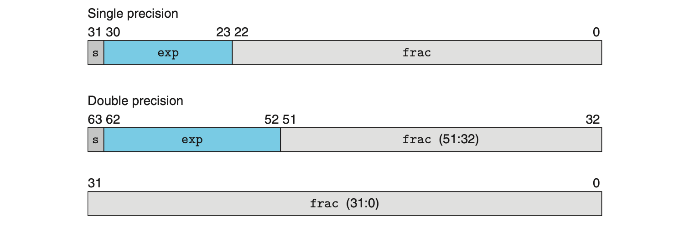

## 2.1.2
为什么 32 位的系统的虚拟内存只能限制在 4GB

可以表示 $2^{32}-1$ 个位置，也就是 4GB

## 2.1.3
big/little endian

Consider a $w$-bit integer having a bit representation $[x_{w−1}, x_{w−2}, . . . , x_1, x_0]$, where $x_{w−1}$ is the most significant bit and $x_0$ is the least.

对于 $0x01234567$
* 大端就是重要的优先，也就是最符合人类直觉的存储方式 $01\ 23\ 45\ 67$
* 小端则是恰好反过来 $67\ 45\ 23\ 01$

但是需要注意，在计算机中 $[x_{w−1}, x_{w−2}, . . . , x_1, x_0]$ 中，越往右，计算机的字节地址就越大。所以大端的最高阶Byte $01$ 反而是存储在计算机地址的低位；而小端的 $01$ 则是存储在计算机地址的最高位，符合“计算机”的直觉。


```python
#include <stdio.h>

typedef unsigned char *byte_pointer;
void show_bytes(byte_pointer start, size_t len) {
    int i;
    for (i=0;i<len;i++) printf(" %.2x", start[i]);
    printf("\n");
}
void show_int(int x) {
    show_bytes((byte_pointer) &x, sizeof(int));
}
void show_float(float x) {
    show_bytes((byte_pointer) &x, sizeof(float));
}
void show_pointer(void *x) {
    show_bytes((byte_pointer) &x, sizeof(void *));
}

int main() {
    int i32 = 114514; // 0x01_bf_52 
    show_int(i32); // 很显然 macbook air m2 是小端
    
    float f32 = (float) i32;
    show_float(f32);
    
    // 地址正好是高地址向低地址增长 4Byte
    show_pointer(&i32);
    show_pointer(&f32);
}
```

     // output
     52 bf 01 00
     00 a9 df 47
     3c ae 1a 6f 01 00 00 00
     38 ae 1a 6f 01 00 00 00


```python
// Practice 2.6
#include<stdio.h>

typedef unsigned char *byte_pointer;
void show_bits(byte_pointer start, size_t len) {    
    for (int i=len-1;i>=0;i--) {
        for (int j=7;j>=0;j--) printf("%u", start[i]>>j & 1);
    }
    printf("\n");
}
void show_int(int x) {
    show_bits((byte_pointer) &x, sizeof(int));
}
void show_float(float x) {
    show_bits((byte_pointer) &x, sizeof(float));
}
int main () {
    int a = 2607352;
    show_int(a);
    
    long b = 3510593.0;
    show_float(b);
}

// 110010001 match
```

    // output
    00000000001001111100100011111000
    01001010010101100100010100000100


```python
// Practice 2.7
#include<string.h>
#include<stdio.h>

typedef unsigned char *byte_pointer;
void show_bytes(byte_pointer start, size_t len) {
    int i;
    for (i=0;i<len;i++) printf(" %.2x", start[i]);
    printf("\n");
}

int main(){
    const char *m = "mnopqr";
    show_bytes((byte_pointer) m, strlen(m));
}

// letters ‘a’ through ‘z’ have ASCII codes 0x61 through 0x7A.
// m = 0x6d, r = 0x72
```

    // output
    6d 6e 6f 70 71 72


```python
// Practice 2.12

#include<stdio.h>
typedef unsigned char *byte_pointer;
void keep_least_significant(byte_pointer start, size_t len) {
    int i;
    for (i=1;i<len;i++) start[i] &= 0;
}

void complement_but_least(byte_pointer start, size_t len) {
    int i;
    for (i=1;i<len;i++) start[i] = ~start[i];
}

void show_bytes(byte_pointer start, size_t len) {
    int i;
    for (i=0;i<len;i++) printf(" %.2x", start[i]);
    printf("\n");
}

int main(){
    int x = 0x87654321;
    keep_least_significant((byte_pointer) &x, sizeof(int));
    show_bytes((byte_pointer) &x, sizeof(int));
    
    x = 0x87654321;
    complement_but_least((byte_pointer) &x, sizeof(int));
    show_bytes((byte_pointer) &x, sizeof(int));
}
```

    // output
    21 00 00 00
    21 bc 9a 78


```python
// Practice 2.13
#include<stdio.h>

int bis(int x, int m){ return x|m; }
int bic(int x, int m){ return x&~m; }
int or(int x, int y){ return bis(x,y); }
int xor(int x, int y){ return bis(bic(x,y), bic(y,x)); }

int main(){
    int i,j;
    i=0;
    j=0x01;

    printf("ans: %d", xor(i, j));
    return 0;
}
```

    // output
    ans: 1


```python
// Practice 2.15
#include<stdbool.h>
#include<stdio.h>

bool myEq(int x, int y) {
    return !(~x & y);
}

int main(){
    int i,j;
    i=114514;
    j=114514;
    
    printf("i = %d, j = %d\n", i, j);
    if (myEq(i, j)) { printf("i == j\n"); }
    else { printf("i != j\n"); }
    
    i=114514;
    j=11451419;
    
    printf("i = %d, j = %d\n", i, j);
    if (myEq(i, j)) { printf("i == j\n"); }
    else { printf("i != j\n"); }
}
```

    // output
    i = 114514, j = 114514
    i == j
    i = 114514, j = 11451419
    i != j


```python
// Practice 2.25
#include<stdio.h>

float sum_elements(float a[], int length){
    int i;
    float result = 0;

    for(i = 0; i <= length-1; i++){
        if(i==1) printf("hi here %d %d\n", i, i==1);
        //printf("hi here %d %d\n", i, i==1);
        result +=a[i];
    }
    return result;
}

int main(){
    float a[] = {1,2,3,4};
    int length = 0;
    return sum_elements(a, length);
} 
```


```python
// Practice 2.30
#include<stdio.h>
#include<limits.h>

int add_ok(int x, int y){
    int sum = x+y;
    int neg_over = x < 0 && y < 0 && sum > 0;
    int pos_over = x > 0 && y > 0 && sum < 0;
    return !neg_over && !pos_over;
}

int main(){
    int a, b = 114514;
    a = INT_MAX;
    if (add_ok(a, b)) {
        printf("add with no overflow\n");
    } else {
        printf("add with overflow\n");
    }
}
```

    // output
    add with overflow


## 2.4.1 Fractional Binary Numbers

A first step in understanding floating-point numbers is to consider binary numbers having fractional values.

$$d_m\ d_{m−1}\ ...d_1\ d_0\ .\ d_{−1}\ d_{−2}\  ...d_{−n}$$

where each decimal digit $d_i$ ranges between $0$ and $9$. This notation represents a value $d$ defined as

$$ d = \sum_{i = -n}^{m} 10^i \times d_i$$

By analogy, consider a notation of the form

$$b_m\ b_{m−1}\ ...b_1\ b_0\ .\ b_{−1}\ b_{−2}\  ...b_{−n}$$

where each binary digit, or bit, bi ranges between $0$ and $1$. This notation represents a number $b$ defined as

$$ b = \sum_{i = -n}^{m} 2^i \times b_i$$

### How to convert fractions to binary
$0.2912×2=0.5824 → 0.0$

$0.5824×2=1.1648 → 0.01$

$0.1684×2=0.3368 → 0.010$

$0.3368×2=0.6736 → 0.0100$

$0.6736×2=1.3472 → 0.01001$

$0.3472×2=0.6944 → 0.010010$

$0.6944×2=1.3888 → 0.0100101$

## 2.4.2 IEEE Floating-Point Representation

The IEEE floating-point standard represents a number in a form $V = (−1)^s × M × 2^E$:

* The sign $s$ determines whether the number is negative ($s = 1$) or positive ($s = 0$), where the interpretation of the sign bit for numeric value $0$ is handled as a special case.
* The significand $M$ is a fractional binary number that ranges either between 1 and $2 − ε$ or between $0$ and $1 − ε$.
* The exponent $E$ weights the value by a (possibly negative) power of $2$.



The bit representation of a floating-point number is divided into three fields to encode these values:

* The single sign bit s directly encodes the sign s.
* The k-bit exponent field $exp = e_{k−1}\ ...\ e_1e_0$ encodes the exponent $E$.
* The n-bit fraction field $frac = f_{n−1}\ ...\ f_1f_0$ encodes the significand $M$, but the value encoded also depends on whether or not the exponent field equals $0$.


```python
// Practice 2.65

#include <stdio.h>
#include <assert.h>

int odd_ones(unsigned x) {
  x ^= x >> 16;
  x ^= x >> 8;
  x ^= x >> 4;
  x ^= x >> 2;
  x ^= x >> 1;
  x &= 0x1;
  return x;
}

int main(int argc, char* argv[]) {
  assert(odd_ones(0x10101011));
  assert(!odd_ones(0x01010101));
  return 0;
}

// refer to '2.1.3 Odd Number of Signals' in Game: 'Turing Complete'
```
