# 3.2
Parts of processors:
* The _program counter_ (commonly referred to as the PC, and called $%rip$ in x86-64) indicates the address in memory of the next instruction to be executed.

* The integer _register file_ contains 16 named locations storing 64-bit values. These registers can hold addresses (corresponding to C pointers) or integer data. Some registers are used to keep track of critical parts of the program state, while others are used to hold temporary data, such as the arguments and local variables of a procedure, as well as the value to be returned by a function.

* The condition code registers hold status information about the most recently executed arithmetic or logical instruction. These are used to implement con- ditional changes in the control or data flow, such as is required to implement `if` and `while` statements.

* A set of vector registers can each hold one or more integer or floating-point values.

The program memory contains the executable machine code for the program, some information required by the operating system, a run-time stack for managing procedure calls and returns, and blocks of memory allocated by the user (e.g., by using the malloc library function).

As mentioned earlier, the program memory is addressed using virtual addresses. At any given time, only limited subranges of virtual addresses are considered valid. For example, x86-64 virtual addresses are represented by 64-bit words. In current implementations of these machines, the upper $16$ bits must be set to zero, and so an address can potentially specify a byte over a range of $2^{48}$, or $64$ terabytes.

A single machine instruction performs only a very elementary operation. For example, it might add two numbers stored in registers, transfer data between memory and a register, or conditionally branch to a new instruction address. The compiler must generate sequences of such instructions to implement program constructs such as arithmetic expression evaluation, loops, or procedure calls and returns.

Several features about machine code and its disassembled representation are worth noting:

* x86-64 instructions can range in length from 1 to 15 bytes. The instruction encoding is designed so that commonly used instructions and those with fewer operands require a smaller number of bytes than do less common ones or ones with more operands.
* The instruction format is designed in such a way that from a given starting position, there is a unique decoding of the bytes into machine instructions. For example, only the instruction pushq %rbx can start with byte value 53.
* The disassembler determines the assembly code based purely on the byte sequences in the machine-code file. It does not require access to the source or assembly-code versions of the program.
* The disassembler uses a slightly different naming convention for the instructions than does the assembly code generated by gcc. In our example, it has omitted the suffix ‘q’ from many of the instructions. These suffixes are size designators and can be omitted in most cases. Conversely, the disassembler adds the suffix ‘q’ to the call and ret instructions. Again, these suffixes can safely be omitted.

Generating the actual executable code requires running a linker on the set of object-code files, one of which must contain a function main. Suppose in file main.c we had the follo

# 3.3
most assembly-code instructions gener- ated by gcc have a single-character suffix denoting the size of the operand. For example, the data movement instruction has four variants: movb (move byte), movw (move word), movl (move double word), and movq (move quad word). The suffix ‘l’ is used for double words, since 32-bit quantities are considered to be “long words.” The assembly code uses the suffix ‘l’ to denote a 4-byte integer as well as an 8-byte double-precision floating-point number. This causes no ambigu- ity, since floating-point code involves an entirely different set of instructions and registers.

# 3.4


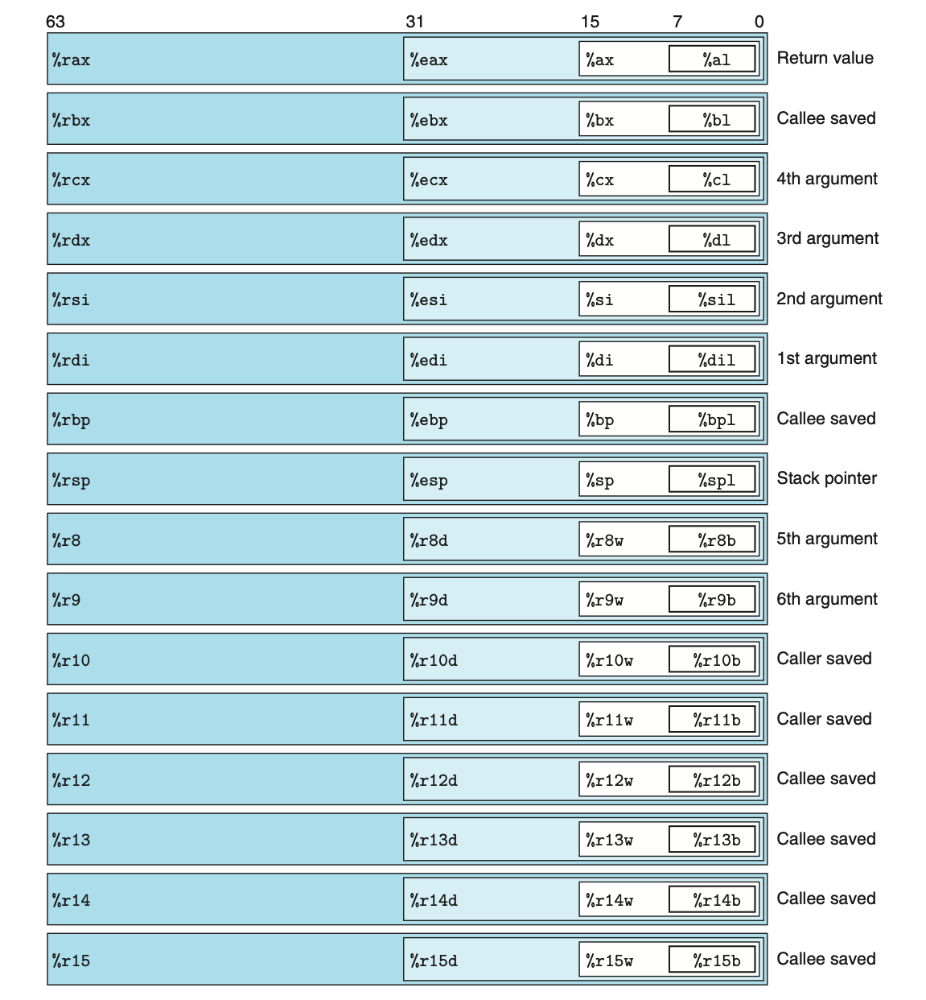
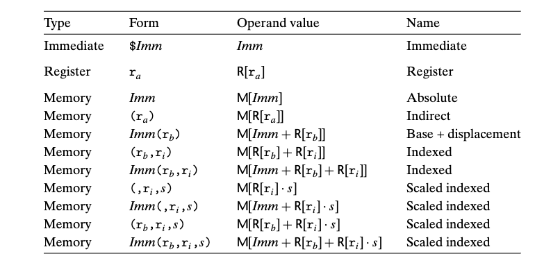

```
1 movl $0x4050,%eax                 # Immediate--Register, 4 bytes
2 movw %bp,%sp                      # Register--Register, 2 bytes
3 movb (%rdi,%rcx),%al              # Memory--Register, 1 byte
4 movb $-17,(%esp)                  # Immediate--Memory, 1 byte
5 movq %rax,-12(%rbp)               # Register--Memory, 8 bytes
```

`movq` can only have immediate source operands
that can be represented as 32-bit two\'s-complement numbers.This value is then
sign extended to produce the 64-bit value for the destination. The movabsq instruction can have an arbitrary 64-bit immediate value as its source operand and
can only have a register as a destination.

```
1 movabsq $0x0011223344556677, %rax # %rax = 0011223344556677
2 movb $-1, %al                     # %rax = 00112233445566FF
3 movw $-1, %ax                     # %rax = 001122334455FFFF
4 movl $-1, %eax                    # %rax = 00000000FFFFFFFF
5 movq $-1, %rax                    # %rax = FFFFFFFFFFFFFFFF
```

那么这是为什么呢？
* 64位数的操作在指令架构集中需要额外的标记，这个标记会增加指令的长度，所以默认是操作32位数
* [difference-between-movq-and-movabsq-in-x86-64](https://stackoverflow.com/questions/40315803/difference-between-movq-and-movabsq-in-x86-64)

`cltq` has no
operands—it always uses register `%eax` as its source and `%rax` as the destination for
the sign-extended result. It therefore has the exact same effect as the instruction
movslq `%eax`, `%rax`, but it has a more compact encoding.

### **Practice Problem 3.4**
Assume variables sp and dp are declared with types
```
src_t *sp;
dest_t *dp;
```
where `src_t` and `dest_t` are data types declared with typedef. We wish to use
the appropriate pair of data movement instructions to implement the operation
```
*dp = (dest_t) *sp;
```

__int -> char__:

Ans:

为什么答案是 
```
movl (%rdi), %eax   Read 4 bytes
movb %al, (%rsi)    Store low-order byte
```
而不是
```
movb (%rdi), %al    Read 1 bytes
movb %al, (%rsi)    Store low-order byte
```
实测两者都是可以的，但是从内存搬到寄存器时不能裁剪原来类型的值，尽管后者所占的机器码更少。

__char -> int__:

Ans:
为什么答案是
```
movsbw (%rdi), %ax  Read byte and sign-extend
movw %ax, (%rsi)    Store 2 bytes
```
而不是
```
movb (%rdi), %al    Read byte
movsbw %al, (%rsi)  Extend and store 2 bytes
```
因为 `movsbw` 的destination只能是寄存器，不能是内存

__unsigned char -> long__:

Ans:
为什么答案是
```
movzbl (%rdi), %eax Read byte and zero-extend
movq %rax, (%rsi)   Store 8 bytes
```
而不是
```
movzbq (%rdi), %rax Read byte and zero-extend
movq %rax, (%rsi)   Store 8 bytes
```
[知乎上可能的解释](https://www.zhihu.com/question/490868415)，即x86-64机器上`movzbl`会自动将 upper 4 byte 置0。所以使用`movzbl`代替`movzbq`可以减少指令长度。


The `pushq` instruction provides the ability to push data onto the stack, while
the `popq` instruction pops it. Each of these instructions **takes a single operand**—the
data source for pushing and the data destination for popping.

the behavior of the instruction `pushq %rbp` is equivalent to that of the
pair of instructions
```
subq $8,%rsp          Decrement stack pointer
movq %rbp,(%rsp)      Store %rbp on stack
```

except that the pushq instruction is encoded in the machine code as a single byte,
whereas the pair of instructions shown above requires a total of 8 bytes. 

Popping a quad word involves reading from the top-of-stack location and
then incrementing the stack pointer by 8. Therefore, the instruction `popq %rax`
is equivalent to the following pair of instructions:
```
movq (%rsp),%rax      Read %rax from stack
addq $8,%rsp          Increment stack pointer
```

# 3.5

## 3.5.1`leaq`
The _load effective address instruction_ `leaq` is actually a variant of the `movq` instruction.
It has the form of an instruction that reads from memory to a register. The destination operand must be a register.

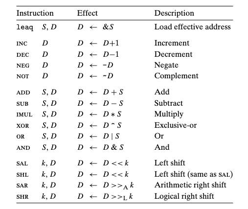

## 3.5.2 Unary and Binary Operations
This operand can be either a register or
a memory location. For example, the instruction `incq (%rsp)` causes the 8-byte
element on the top of the stack to be incremented. This syntax is reminiscent of
the C increment (++) and decrement (--) operators.

## 3.5.3 Shift Operations
The final group consists of shift operations, where the shift amount is given first
and the value to shift is given second. Both arithmetic and logical right shifts are
possible. The different shift instructions can specify the shift amount either as
an immediate value or with the single-byte register %cl.

## 3.5.5 Special Arithmetic Operations

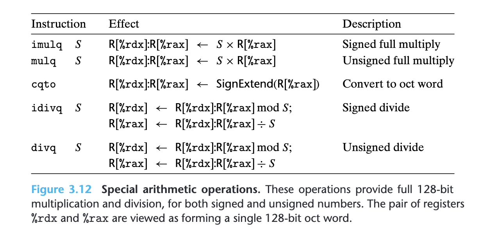

## 3.6.2 Accessing the Condition Codes

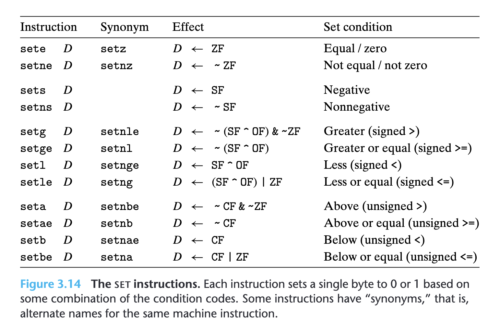

## 3.6.3 Jump Instructions

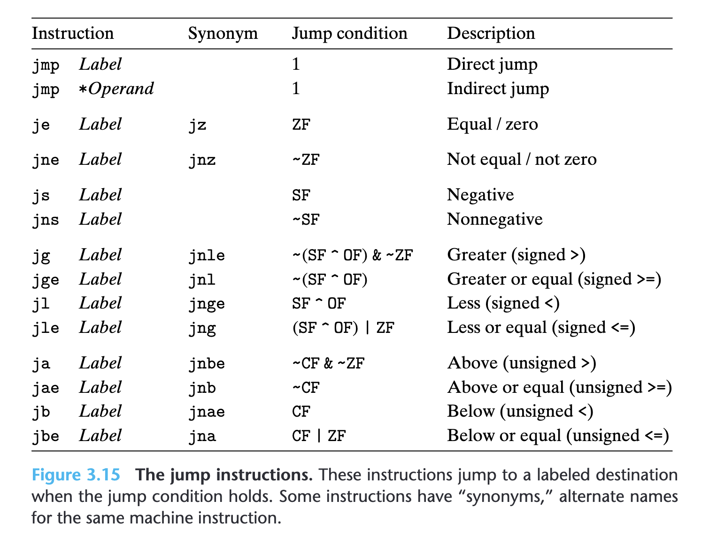

## 3.6.6 Implementing Conditional Branches with Conditional Moves 

这一小节非常重要

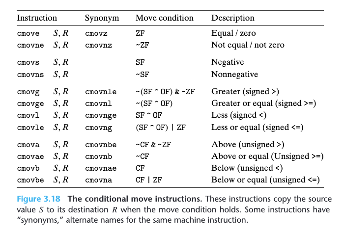

## 3.6.8 Switch Statements

use a data structure call `jump table`. the use of a jump table allows a very efficient way to implement a multiway branch.


# 3.7 Procedures

Procedures come in many guises in different programming languages—functions, methods, subroutines, handlers, and so on—but they all share a general set of features.

* `Passing control.` The program counter must be set to the starting address of the code for Q upon entry and then set to the instruction in P following the call to Q upon return.
* `Passing data.` P must be able to provide one or more parameters to Q, and Q must be able to return a value back to P.
* `Allocating and deallocating memory.` Q may need to allocate space for local variables when it begins and then free that storage before it returns.

## 3.7.1 The Run-Time Stack

a program can manage the storage required by its procedures using a stack, where the stack and the program registers store the information required for passing control and data, and for allocating memory.
As P calls Q, control and data information are added to the end of the stack. This information gets deallocated when P returns.

When an x86-64 procedure requires storage beyond what it can hold in registers, it allocates space on the stack. This region is referred to as the procedure’s `stack frame`.

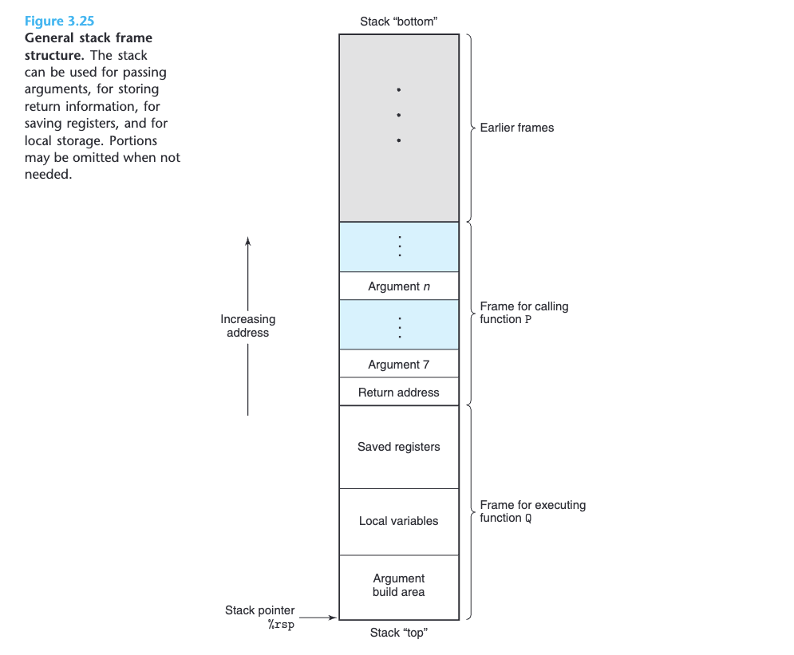

When procedure P calls procedure Q, it will push the return address onto the stack, indicating where within P the program should resume execution once Q returns. We consider the return address to be part of P’s stack frame, since it holds state relevant to P. The code for Q allocates the space required for its stack frame by extending the current stack boundary. Within that space, it can save the values of registers, allocate space for local variables, and set up arguments for the procedures it calls. The stack frames for most procedures are of fixed size, allocated at the beginning of the procedure. Some procedures, however, require variable-size frames. 

In the interest of space and time efficiency, x86-64 procedures allocate only the portions of stack frames they require. For example, many procedures have six or fewer arguments, and so all of their parameters can be passed in registers. Thus, parts of the stack frame diagrammed in Figure 3.25 may be omitted. **Indeed, many functions do not even require a stack frame.** This occurs when all of the local variables can be held in registers and the function does not call any other functions (sometimes referred to as a leaf procedure, in reference to the tree structure of procedure calls).


## 3.7.2 Control Transfer

Passing control from function P to function Q involves simply setting the program counter (PC) to the starting address of the code for Q. However, when it later comes time for Q to return, the processor must have some record of the code location where it should resume the execution of P. This information is recorded in x86-64 machines by invoking procedure Q with the instruction call Q. This instruction pushes an address A onto the stack and sets the PC to the beginning of Q. The pushed address A is referred to as the return address and is computed as the address of the instruction immediately following the call instruction. The counterpart instruction ret pops an address A off the stack and sets the PC to A.

## 3.7.3 Data Transfer

When a function has more than six integral arguments, the other ones are
passed on the stack. Assume that procedure P calls procedure Q with n integral arguments, such that $n > 6$. Then the code for P must allocate a stack frame with enough storage for arguments 7 through n, as illustrated in `Figure 3.25`.

It copies arguments 1–6 into the appropriate registers, and it puts arguments 7 through n onto the stack, with argument 7 at the top of the stack. **When passing parameters on the stack, all data sizes are rounded up to be multiples of eight.** With the arguments in place, the program can then execute a call instruction to transfer control to procedure Q. Procedure Q can access its arguments via registers and possibly from the stack. If Q, in turn, calls some function that has more than six
arguments, it can allocate space within its stack frame for these, as is illustrated by the area labeled “Argument build area” in `Figure 3.25`.

## 3.7.4 Local Storage on the Stack

Most of the procedure examples we have seen so far did not require any local storage beyond what could be held in registers. At times, however, local data must be stored in memory. Common cases of this include these:
* There are not enough registers to hold all of the local data.
* The address operator ‘&’ is applied to a **local variable**, and hence we must be able to generate an address for it.
* Some of the local variables are arrays or structures and hence must be accessed by array or structure references. We will discuss this possibility when we describe how arrays and structures are allocated.

# 3.8 Array Allocation and Access
## 3.8.2 Pointer Arithmetic

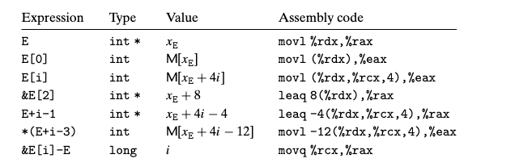

Be careful with the last expr. It shows that one can compute the difference of two pointers within the same data structure, with the result being data having type long and value equal to the difference of the two addresses divided by the size of the data type.

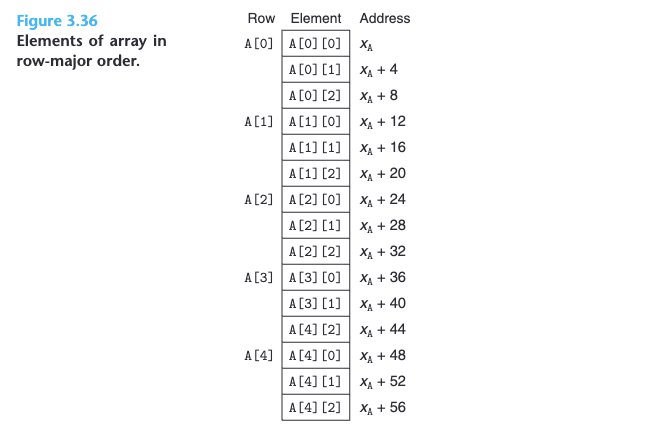

## 3.8.3 Nested Arrays

The general principles of array allocation and referencing hold even when we
create arrays of arrays. For example, the declaration
```
 int A[5][3];
```
is equivalent to the declaration
```
typedef int row3_t[3];
row3_t A[5];
```

Data type row3_t is defined to be an array of three integers. Array A contains five such elements, each requiring 12 bytes to store the three integers. The total array size is then $4 * 5 * 3 = 60$ bytes.

The array elements are ordered in memory in row-major order. In general, for an array declared as
```
T D[R][C];
```
array element D[i][j] is at memory address
```
&D[i][j] = x_D + L(C*i + j)
```

# 3.11 Floating-Point Code

## 3.11.1 Floating-Point Movement and Conversion Operations

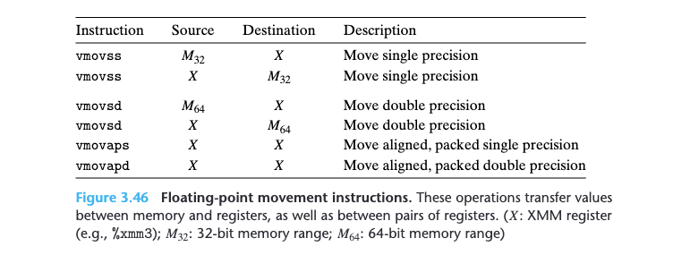

 Those that reference memory are scalar instructions, meaning that they operate on individual, rather than packed, data values. The data are held either in memory (indicated in the table as $M_{32}$ and $M_{64}$) or in XMM registers (shown in the table as X). These instructions will work correctly regardless of the alignment of data, although the code optimization guidelines recommend that 32-bit memory data satisfy a 4-byte alignment and that 64-bit data satisfy an 8-byte alignment. Memory references are specified in the same way as for the integer mov instructions, with all of the different possible combinations of displacement, base register, index register, and scaling factor.


以下是关于 individual/packed data 和 scalar/vector instruction 的解释

**Analogy:**

Imagine you have a box of Legos.

* A scalar instruction is like picking up and manipulating a single Lego piece.
* A vector instruction is like using a tool to grab and manipulate multiple Lego pieces at once (e.g., a scooping tool for multiple small pieces).

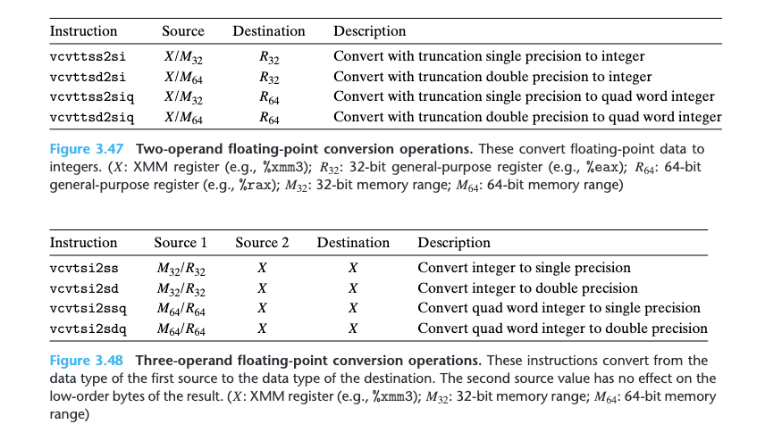

The instructions in **Figure 3.48** convert from integer to floating point. They
use an unusual three-operand format, with two sources and a destination. The
first operand is read from memory or from a general-purpose register. For our
purposes, we can ignore the second operand, since its value only affects the upper bytes of the result. The destination must be an XMM register. 

For converting between two different floating-point formats, current
versions of gcc generate code that requires separate documentation. Suppose
the low-order 4 bytes of %xmm0 hold a single-precision value; then it would seem
straightforward to use the instruction
```
vcvtss2sd %xmm0, %xmm0, %xmm0
```

to convert this to a double-precision value and store the result in the lower 8 bytesof register %xmm0. Instead, we find the following code generated by gcc:
```
vunpcklps %xmm0, %xmm0, %xmm0
vcvtps2pd %xmm0, %xmm0
```
The vunpcklps instruction is normally used to interleave the values in two
XMM registers and store them in a third. That is, if one source register contains
words $[s_3, s_2, s_1, s_0 ]$ and the other contains words $[d_3, d_2, d_1, d_0 ]$, then the value
of the destination register will be $[s_1, d_1, s_0, d_0 ]$. In the code above, we see the
same register being used for all three operands, and so if the original register
held values $[x_3, x_2, x_1, x_0 ]$, then the instruction will update the register to hold
values $[x_1, x_1, x_0, x_0 ]$. The vcvtps2pd instruction expands the two low-order single-precision values in the source XMM register to be the two double-precision values
in the destination XMM register. Applying this to the result of the preceding
vunpcklps instruction would give values $[dx_0, dx_0 ]$, where dx0 is the result of
converting x to double precision. That is, the net effect of the two instructions is
to convert the original single-precision value in the low-order 4 bytes of %xmm0 to
double precision and store two copies of it in %xmm0. **It is unclear why gcc generates
this code. There is neither benefit nor need to have the value duplicated within
the XMM register.**

Gcc generates similar code for converting from double precision to single
precision:
```
vmovddup %xmm0, %xmm0 # Replicate first vector element
vcvtpd2psx %xmm0, %xmm0
```

Suppose these instructions start with register %xmm0 holding two double-precision
values $[x_1, x_0 ]$. Then the vmovddup instruction will set it to $[x0, x0 ]$. The vcvtpd2psx
instruction will convert these values to single precision, pack them into the
low-order half of the register, and set the upper half to 0, yielding a result
$[0.0, 0.0, x_0, x_0 ]$ (recall that floating-point value 0.0 is represented by a bit pattern of all zeros). **Again, there is no clear value in computing the conversion from
one precision to another this way, rather than by using the single instruction**
```
vcvtsd2ss %xmm0, %xmm0, %xmm0
```
%xmm0 is the designated return register for float
or double values.

## 3.11.2 Floating-Point Code in Procedures

* p to eight floating-point arguments can be passed in XMM registers %xmm0–
%xmm7. These registers are used in the order the arguments are listed. Addi-
tional floating-point arguments can be passed on the stack.
* A function that returns a floating-point value does so in register %xmm0.
* All XMM registers are caller saved. The callee may overwrite any of these
registers without first saving it.

## 3.11.3 Floating-Point Arithmetic Operations

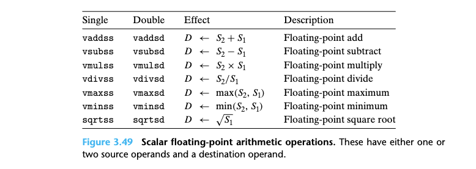
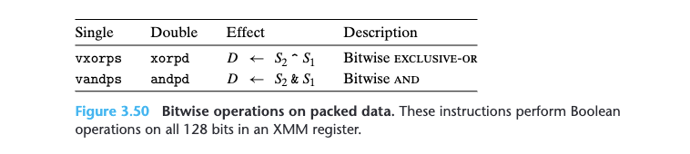

## 3.11.6 Floating-Point Comparison Operations

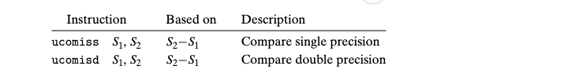
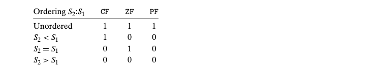

These instructions are similar to the cmp instructions (see **Section 3.6**), in that
they compare operands $S_1$ and $S_2$ (but in the opposite order one might expect) and
set the condition codes to indicate their relative values. As with cmpq, they follow
the ATT-format convention of listing the operands in reverse order. Argument
$S_2$ must be in an $XMM$ register, while $S_1$ can be either in an $XMM$ register or in
memory.

The floating-point comparison instructions set three condition codes: the zero
flag `ZF`, the carry flag `CF`, and the parity flag `PF`. We did not document the parity
flag in **Section 3.6.1**, because it is not commonly found in gcc-generated x86 code.
For integer operations, this flag is set when the most recent arithmetic or logical
operation yielded a value where the least significant byte has even parity (i.e.,
an even number of ones in the byte). For floating-point comparisons, however,
the flag is set when either operand is $NaN$. By convention, any comparison in C
is considered to fail when one of the arguments is $NaN$, and this flag is used to
detect such a condition. For example, even the comparison $x == x$ yields $0$ when $x$
is $NaN$.
