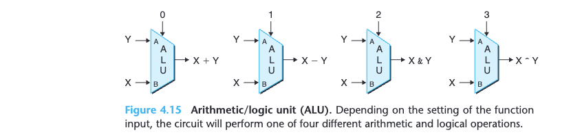
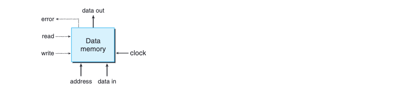

# 
Processor Architecture

As a result, the processor can
be executing the different steps of up to five instructions simultaneously. Making this processor preserve the sequential behavior of the Y86-64 ISA **requires
handling a variety of hazard conditions**, where the location or operands of one
instruction depend on those of other instructions that are still in the pipeline.

我不理解 hazard condition. p390

## 4.1 The Y86-64 Instruction Set Architecture
Defining an instruction set architecture, such as Y86-64, includes 
* defining the
different components of its state.
* the set of instructions and their encodings, a
set of programming conventions.
* the handling of exceptional events.

### 4.1.1 Programmer-Visible State

### 4.1.2 Y86-64 Instructions

=> refer to p393 <=

### 4.1.3 Instruction Encoding
Every
instruction has an initial byte identifying the instruction type. This byte is split
into two 4-bit parts: the high-order, or code, part, and the low-order, or function,
part. Observe that
rrmovq has the same instruction code as the conditional moves. It can be viewed
as an “unconditional move” just as the jmp instruction is an unconditional jump,
both having function code 0.


As shown in Figure 4.4, each of the 15 program registers has an associated
register identifier (ID) ranging from $0$ to $0xE$. The numbering of registers in Y86-64 matches what is used in x86-64. The program registers are stored within the CPU in a register file, a small random access memory where the register IDs serve as addresses. ID value $0xF$ is used in the instruction encodings and within our hardware designs when we need to indicate that no register should be accessed.

### 4.1.4 Y86-64 Exceptions


## 4.2 Logic Design and the Hardware Control Language HCL
### 4.2.2 Combinational Circuits and HCL Boolean Expressions


By assembling a number of logic gates into a network, we can construct computa-
tional blocks known as combinational circuits. Several restrictions are placed on
how the networks are constructed:
* Every logic gate input must be connected to exactly one of the following:
(1) one of the system inputs (known as a primary input), (2) the output
connection of some memory element, or (3) the output of some logic gate.
* The outputs of two or more logic gates cannot be connected together. Oth-
erwise, the two could try to drive the wire toward different voltages, possibly
causing an invalid voltage or a circuit malfunction.
* The network must be acyclic. That is, there cannot be a path through a series
of gates that forms a loop in the network. Such loops can cause ambiguity in
the function computed by the network.

Our HCL expressions demonstrate a clear parallel between combinational
logic circuits and logical expressions in C. They both use Boolean operations to
compute functions over their inputs. Several differences between these two ways
of expressing computation are worth noting:
* Since a combinational circuit consists of a series of logic gates, it has the
property that the outputs continually respond to changes in the inputs. If
some input to the circuit changes, then after some delay, the outputs will
change accordingly. By contrast, a C expression is only evaluated when it is
encountered during the execution of a program.
* Logical expressions in C allow arguments to be arbitrary integers, interpreting
0 as false and anything else as true. In contrast, our logic gates only operate
over the bit values 0 and 1.
* Logical expressions in C have the property that they might only be partially
evaluated. If the outcome of an and or or operation can be determined by just
evaluating the first argument, then the second argument will not be evaluated.
For example, with the C expression
$(a && !a) && func(b,c)$
the function func will not be called, because the expression (a && !a) evalu-
ates to 0. In contrast, combinational logic does not have any partial evaluation
rules. The gates simply respond to changing inputs.


### 4.2.3 Word-Level Combinational Circuits and HCL Integer Expressions


Figure 4.12 shows a combinational
circuit that tests whether two 64-bit words A and B are equal. That is, the output
will equal 1 if and only if each bit of A equals the corresponding bit of B.


One important combinational circuit, known as an
arithmetic/logic unit (ALU), is diagrammed at an abstract level in Figure 4.15.
In our version, the circuit has three inputs: two data inputs labeled A and B and
a control input. Depending on the setting of the control input, the circuit will
perform different arithmetic or logical operations on the data inputs. Observe
that the four operations diagrammed for this ALU correspond to the four different
integer operations supported by the Y86-64 instruction set, and the control values
match the function codes for these instructions (Figure 4.3). Note also the ordering
of operands for subtraction, where the A input is subtracted from the B input.
This ordering is chosen in anticipation of the ordering of arguments in the subq
instruction.


### 4.2.5 Memory and Clocking


**Figure 4.16** gives a more detailed view of a hardware register and how it
operates. For most of the time, the register remains in a fixed state (shown as
x), generating an output equal to its current state. Signals propagate through the
combinational logic preceding the register, creating a new value for the register
input (shown as y), but the register output remains fixed as long as the clock is low.
As the clock rises, the input signals are loaded into the register as its next state
(y), and this becomes the new register output until the next rising clock edge.


This register file has two read ports, named A and B, and one write port, named
W. Such a multiported random access memory allows multiple read and write
operations to take place simultaneously.

The register file is not a combinational circuit, since it has internal storage. In
our implementation, however, data can be read from the register file as if it were
a block of combinational logic having addresses as inputs and the data as outputs.
When either srcA or srcB is set to some register ID, then, after some delay, the
value stored in the corresponding program register will appear on either valA or
valB. For example, setting srcA to 3 will cause the value of program register $\%rbx$
to be read, and this value will appear on output valA.

The writing of words to the register file is controlled by the clock signal in
a manner similar to the loading of values into a clocked register. Every time the
clock rises, the value on input valW is written to the program register indicated by
the register ID on input dstW. When dstW is set to the special ID value 0xF, no
program register is written. Since the register file can be both read and written,
a natural question to ask is, **“What happens if the circuit attempts to read and
write the same register simultaneously?”** The answer is straightforward: if the
same register ID is used for both a read port and the write port, then, as the clock
rises, there will be a transition on the read port’s data output from the old value to
the new.

Our processor has a random access memory for storing program data, as
illustrated below:



This memory has a single address input, a data input for writing, and a data output
for reading. Like the register file, reading from our memory operates in a manner
similar to combinational logic: If we provide an address on the address input and
set the `write` control signal to 0, then after some delay, the value stored at that
address will appear on data out. The `error` signal will be set to 1 if the address
is out of range, and to 0 otherwise. Writing to the memory is controlled by the
clock: We set address to the desired address, data in to the desired value, and
`write` to 1. When we then operate the clock, the specified location in the memory
will be updated, as long as the address is valid. As with the read operation, the
error signal will be set to 1 if the address is invalid. This signal is generated by
combinational logic, since the required bounds checking is purely a function of
the address input and does not involve saving any state.

**Our processor includes an additional read-only memory for reading instruc-
tions. In most actual systems, these memories are merged into a single memory
with two ports: one for reading instructions, and the other for reading or writing data.**


## 4.3 Sequential Y86-64 Implementations
### 4.3.1 Organizing Processing into Stages
In general, processing an instruction involves a number of operations. We organize
them in a particular sequence of stages, attempting to make all instructions follow
a uniform sequence, even though the instructions differ greatly in their actions.
The detailed processing at each step depends on the particular instruction being
executed. Creating this framework will allow us to design a processor that makes
best use of the hardware. The following is an informal description of the stages
and the operations performed within them:

* _Fetch._ Use memory address from program counter, reads the bytes of an instruction. It extracts the two 4-bit portions of the instruction specifier byte, referred to as **icode (the instruction code)** and **ifun (the instruction function)**. It possibly fetches a register specifier byte, giving one or both of the register operand specifiers **rA** and **rB**. It also possibly fetches an 8-byte constant word **valC**. It computes **valP** to be the address of the instruction following the current one in sequential order. That is, **valP** equals the value of the PC plus the length of the fetched instruction.

   $ [icode][ifun][rA?[rB?]][valC?] $

* _Decode._ The decode stage reads up to two operands from the register file, giving values **valA** and/or **valB**. Typically, it reads the registers designated by instruction fields **rA** and **rB**, but for some instructions it reads register $\%rsp$.

* _Execute._ In the execute stage, the arithmetic/logic unit (ALU) either performs the operation specified by the instruction (according to the value of **ifun**). We refer to the resulting value as **valE**. The condition codes are possibly set. For a conditional move instruction, the stage will evaluate the condition codes and move condition (given by ifun) and **enable the updating of the destination register only if the condition holds**. Similarly, for a jump instruction, it determines whether or not the branch should be taken.

* _Memory._ The memory stage may write data to memory, or it may read data
from memory. We refer to the value read as **valM**.

* _Write back._ The write-back stage writes up to two results to the register file.

* _PC update._ The PC is set to the address of the next instruction.


**Figure 4.23** gives a more detailed view of the hardware required to implement
SEQ. We use the following drawing conventions:

* _Clocked registers_ are shown as _white rectangles_. The program counter PC is the only clocked register in SEQ.
* _Hardware units_ are shown as _light blue boxes_. These include the memories,
the ALU, and so forth. We will use the same basic set of units for all of our
processor implementations. We will treat these units as “black boxes” and not
go into their detailed designs.
* _Control logic blocks_ are drawn as _gray rounded rectangles_. These blocks serve to select from among a set of signal sources or to compute some Boolean function. We will examine these blocks in complete detail, including developing
HCL descriptions.
* _Wire names_ are indicated in _white circles_. These are simply labels on the wires, not any kind of hardware element.
* _Word-wide data connections_ are shown as _medium lines_. Each of these lines
actually represents a bundle of 64 wires, connected in parallel, for transferring a word from one part of the hardware to another.
* _Byte and narrower data connections_ are shown as _thin lines_. Each of these lines actually represents a bundle of four or eight wires, depending on what type of values must be carried on the wires.
* _Single-bit connections_ are shown as _dotted lines_. These represent control values passed between the units and blocks on the chip.


### 4.3.3 SEQ Timing
Our implementation of SEQ consists of **combinational logic** and two forms of memory devices: **clocked registers** (the program counter and condition code register) and **random access memories** (the register file, the instruction memory, and the data memory). **Combinational logic does not require any sequencing** or control—values propagate through a network of logic gates whenever the inputs change.As we have described, we also assume that **reading from a random access memory operates much like combinational logic**, with the output word generated based on the address input. Since our **instruction memory** is only used to read instructions, we can therefore treat this unit as if it were combinational logic.

We are left with just four hardware units that require an explicit control over their sequencing—the **program counter**, the one **condition code register**, the **data memory**, and the **register file**. These are controlled via a single clock signal that triggers the loading of new values into the registers and the writing of values to the random access memories. The program counter is loaded with a new instruction address every clock cycle. The condition code register is loaded only when an integer operation instruction is executed. The data memory is written only when an rmmovq, pushq, or call instruction is executed. The two write ports of the register file allow two program registers to be updated on every cycle, but we can use the special register ID 0xF as a port address to indicate that no write should be performed for this port.

This clocking of the registers and memories is all that is required to control the
sequencing of activities in our processor. Our hardware achieves the same effect as
would a sequential execution of the assignments shown in the tables of Figures 4.18
through 4.21, even though all of the state updates actually occur simultaneously
and only as the clock rises to start the next cycle. This equivalence holds because
of the nature of the Y86-64 instruction set, and because we have organized the
computations in such a way that our design obeys the following principle:

**principle: No reading back,** The processor never needs to read back the state updated by an instruction in
order to complete the processing of this instruction.

This principle is crucial to the success of our implementation. As an illustra-
tion, suppose we implemented the pushq instruction by first decrementing %rsp
by 8 and then using the updated value of %rsp as the address of a write operation.
This approach would violate the principle stated above. It would require reading
the updated stack pointer from the register file in order to perform the memory
operation. Instead, our implementation (Figure 4.20) generates the decremented
value of the stack pointer as the signal valE and then uses this signal both as the
data for the register write and the address for the memory write. As a result, it
can perform the register and memory writes simultaneously as the clock rises to
begin the next clock cycle.


The color coding in Figure 4.25 indicates how the circuit signals relate to the
different instructions being executed. We assume the processing starts with the
condition codes, listed in the order ZF, SF, and OF, set to 100. At the beginning of
clock cycle 3 (point 1), the state elements hold the state as updated by the second
irmovq instruction (line 2 of the listing), shown in light gray. The combinational
logic is shown in white, indicating that it has not yet had time to react to the
changed state. The clock cycle begins with address 0x014 loaded into the program
counter. This causes the addq instruction (line 3 of the listing), shown in blue, to
be fetched and processed. Values flow through the combinational logic, including
the reading of the random access memories. By the end of the cycle (point 2),
the combinational logic has generated new values (000) for the condition codes,
an update for program register %rbx, and a new value (0x016) for the program
counter. At this point, the combinational logic has been updated according to the
addq instruction (shown in blue), but the state still holds the values set by the
second irmovq instruction (shown in light gray).

As the clock rises to begin cycle 4 (point 3), the updates to the program
counter, the register file, and the condition code register occur, and so we show
these in blue, but the combinational logic has not yet reacted to these changes, and
so we show this in white. In this cycle, the je instruction (line 4 in the listing), shown
in dark gray, is fetched and executed. Since condition code ZF is 0, the branch is not
taken. By the end of the cycle (point 4), a new value of 0x01f has been generated
for the program counter. The combinational logic has been updated according to
the je instruction (shown in dark gray), but the state still holds the values set by
the addq instruction (shown in blue) until the next cycle begins.

As this example illustrates, the use of a clock to control the updating of the
state elements, combined with the propagation of values through combinational
logic, suffices to control the computations performed for each instruction in our
implementation of SEQ. Every time the clock transitions from low to high, the
processor begins executing a new instruction.


## 4.4 General Principles of Pipelining

Interesting section, just read through.


## 4.5 Pipelined Y86-64 Implementations

Interesting section, just read through.


```python

```
