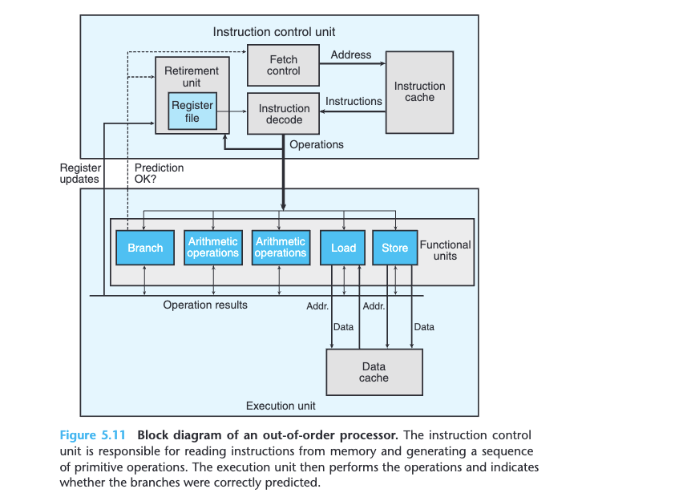
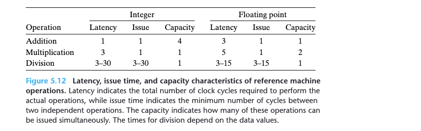
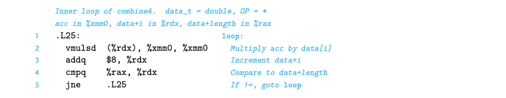
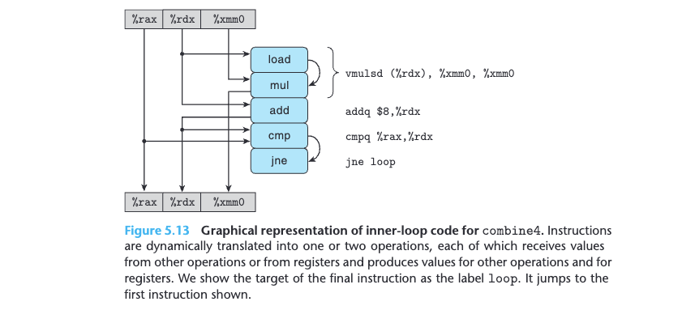
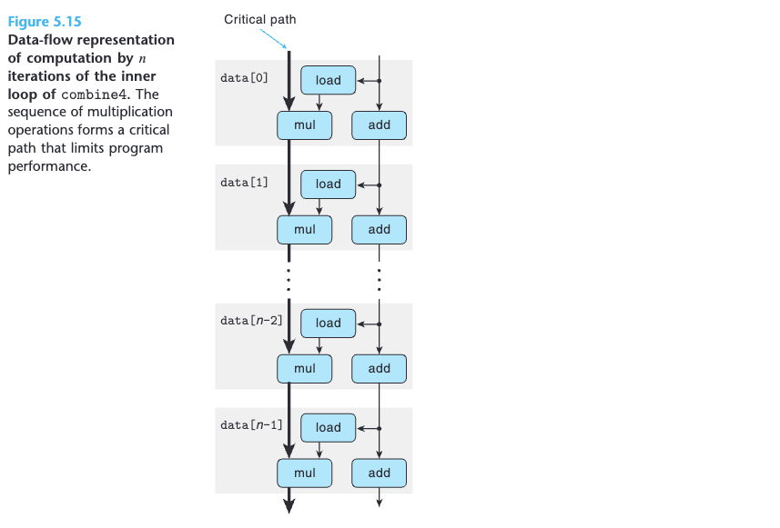

# 5 Optimizing Program Performance

**It can be difficult to explain exactly why a particular code sequence has a particular execution time. Performance can depend on many detailed features of the processor design for which we have relatively little documentation or understanding. This is another reason to try a number of different variations and combinations of techniques.**

To novice programmers, it might seem strange to keep modifying the source
code in an attempt to coax the compiler into generating efficient code, but this is indeed how many high-performance programs are written. Compared to the
alternative of writing code in assembly language, this indirect approach has the advantage that the resulting code will still run on other machines, although perhaps not with peak performance.

## 5.1 Capabilities and Limitations of Optimizing Compilers
Invoking gcc with the command-line option -Og specifies that it should apply a basic set of optimizations. Invoking gcc with option -O1 or higher (e.g., -O2 or -O3) will cause it to apply more extensive optimizations. These can further improve program performance, but they may expand the program size and they may make the program more difficult to debug using standard debugging tools. 

For our presentation, we will mostly consider code compiled with optimization level -O1, even though level -O2 has become the accepted standard for most software projects that use gcc. We purposely limit the level of optimization to demonstrate how different ways of writing a function in C can affect the efficiency of the code generated by a compiler. We will find that we can write C code that, when compiled just with option -O1, vastly outperforms a more naive version compiled with the highest possible optimization levels.


## 5.3 Program Example
In our experience, the best approach involves a combination of experimentation and analysis: repeatedly attempting different approaches, performing measurements, and examining the assembly-code representations to identify underlying performance bottlenecks.

## 5.4 Eliminating Loop Inefficiencies
In our experience, the best approach involves a combination of experimentation and analysis: repeatedly attempting different approaches, performing measurements, and examining the assembly-code representations to identify underlying performance bottlenecks.

## 5.7 Understanding Modern Processors
The latency bound is encountered when a series of operations must be performed in strict sequence, because the result of one operation is required before the next one can begin. **This bound can limit program performance when the data dependencies in the code limit the ability of the processor to exploit instruction-level parallelism**. The **throughput bound characterizes the raw computing capacity of the processor’s functional units**. This bound becomes the ultimate limit on program performance.

### 5.7.1 Overall Operation


In a typical x86 implementation, an instruction that only operates on registers, such as

$addq \%rax,\%rdx$

is converted into a single operation. On the other hand, an instruction involving one or more memory references, such as

$addq \%rax,8(\%rdx)$

yields multiple operations, separating the memory references from the arithmetic operations. This particular instruction would be decoded as three operations: one to load a value from memory into the processor, one to add the loaded value to the value in register $\%eax$, and one to store the result back to memory. The decoding splits instructions to allow a division of labor among a set of dedicated hardware units. These units can then execute the different parts of multiple instructions in parallel.

The most common mechanism for controlling the communication of operands among the execution units is called register renaming. When an instruction that updates register `r` is decoded, a tag `t` is generated giving a unique identifier to the result of the operation. An entry `(r, t)` is added to a table maintaining the association between program register `r` and tag `t` for an operation that will update this register. When a subsequent instruction using register `r` as an operand is decoded, the operation sent to the execution unit will contain `t` as the source for the operand value. When some execution unit completes the first operation, it generates a result `(v, t)`, indicating that the operation with tag `t` produced value `v`. Any operation waiting for `t` as a source will then use `v` as the source value, a form of data forwarding. By this mechanism, values can be forwarded directly from one operation to another, rather than being written to and read from the register file, enabling the second operation to begin as soon as the first has completed. The renaming table only contains entries for registers having pending write operations. When a decoded instruction requires a register r, and there is no tag associated with this register, the operand is retrieved directly from the register file. With register renaming, an entire sequence of operations can be performed speculatively, even though the registers are updated only after the processor is certain of the branch outcomes.


### 5.7.2 Functional Unit Performance



We see that the latencies increase in going from integer to floating-point operations. We see also that the addition and multiplication operations all have issue times of 1, meaning that on each clock cycle, the processor can start a new one of these operations. This short issue time is achieved through the use of _pipelining_.A pipelined function unit is implemented as a series of _stages_, each of which performs part of the operation. For example, a typical floating- point adder contains three stages (and hence the three-cycle latency): one to process the exponent values, one to add the fractions, and one to round the result. The arithmetic operations can proceed through the stages in close succession rather than waiting for one operation to complete before the next begins. This capability can be exploited only if there are successive, logically independent operations to be performed. Functional units with issue times of 1 cycle are said to be _fully pipelined_: they can start a new operation every clock cycle. Operations with capacity greater than 1 arise due to the capabilities of the multiple functional units, as was described earlier for the reference machine.

We see also that the divider (used for integer and floating-point division, as well as floating-point square root) is not pipelined—its issue time equals its latency. What this means is that the divider must perform a complete division before it can begin a new one. We also see that the latencies and issue times for division are given as ranges, because some combinations of dividend and divisor require more steps than others. The long latency and issue times of division make it a comparatively costly operation.

A more common way of expressing issue time is to specify the maximum throughput of the unit, defined as the reciprocal of the issue time. A fully pipelined functional unit has a maximum throughput of 1 operation per clock cycle, while units with higher issue times have lower maximum throughput. Having multiple functional units can increase throughput even further. For an operation with capacity $C$ and issue time $I$ , the processor can potentially achieve a throughput of $I/C$ operations per clock cycle. But it is only a ideal situation, the number of loader will also affect the throughtout, limit the performance.

### 5.7.3 An Abstract Model of Processor Operation

**From Machine-Level Code to Data-Flow Graphs**



As **Figure 5.13** indicates, with our hypothetical processor design, the four instructions are expanded by the instruction decoder into a series of five operations, with the initial multiplication instruction being expanded into a load operation to read the source operand from memory, and a mul operation to perform the multiplication.

For a code segment forming a loop, we can classify the registers that are
accessed into four categories:

* _Read-only._ These are used as source values, either as data or to compute memory addresses, but they are not modified within the loop. The only read-
only register for the loop in combine4 is $\%rax$.
* _Write-only._ These are used as the destinations of data-movement operations.
There are no such registers in this loop.
* _Local._ These are updated and used within the loop, but there is no dependency from one iteration to another. The condition code registers are examples for this loop: they are updated by the `cmp` operation and used by the `jne` operation, but this dependency is contained within individual iterations.
* _Loop._ These are used both as source values and as destinations for the loop, with the value generated in one iteration being used in another. We can see that $\%rdx$ and $\%xmm0$ are loop registers for `combine4`, corresponding to program values $data+i$ and $acc$.

* 

**Figure 5.15** shows the data-flow representation of `n` iterations by the inner loop of function `combine4`. This graph was obtained by simply replicating the template shown in **Figure 5.14(b)** `n` times. We can see that the program has two chains of data dependencies, corresponding to the updating of program values $acc$ and $data+i$ with operations `mul` and `add`, respectively. Given that floating-point multiplication has a latency of 5 cycles, while integer addition has a latency of 1 cycle, we can see that the chain on the left will form a critical path, requiring 5n cycles to execute. The chain on the right would require only `n` cycles to execute, and so it does not limit the program performance.

**Figure 5.15** demonstrates why we achieved a CPE equal to the latency bound
of 5 cycles for `combine4`, when performing floating-point multiplication. When executing the function, the floating-point multiplier becomes the limiting resource.
The other operations required during the loop—manipulating and testing pointer
value $data+i$ and reading data from memory—proceed in parallel with the mul- tiplication. As each successive value of $acc$ is computed, it is fed back around to compute the next value, but this will not occur until 5 cycles later.

The flow for other combinations of data type and operation are identical to
those shown in **Figure 5.15**, but with a different data operation forming the chain of data dependencies shown on the left. For all of the cases where the operation has a latency `L` greater than 1, we see that the measured CPE is simply `L`, indicating that this chain forms the performance-limiting critical path.


## 5.8 Loop Unrolling

Loop unrolling is a program transformation that reduces the number of iterations for a loop by increasing the number of elements computed on each iteration. We saw an example of this with the function `psum2` (**Figure 5.1**), where each iteration computes two elements of the prefix sum, thereby halving the total number of iterations required. Loop unrolling can improve performance in two ways. First, it reduces the number of operations that do not contribute directly to the program result, such as loop indexing and conditional branching. Second, it exposes ways in which we can further transform the code to reduce the number of operations in the critical paths of the overall computation.

这里可以使用 loop unrolling 改进 integer 的性能的原因在于减少了循环中 integer 加法的次数，而没有提升其他类型的原因在于其他的运算的瓶颈都不在加法上。

## 5.9 Enhancing Parallelism

Just read through, Bravooo!

## 5.11 Some Limiting Factors

Just read through, Bravooo!


## 5.12 Understanding Memory Performance

Just read through, Bravooo!

## 5.13 Life in the Real World: Performance Improvement Techniques

Just read through, Bravooo!

## 5.14 Identifying and Eliminating Performance Bottlenecks

Just read through, Bravooo!


```python

```
