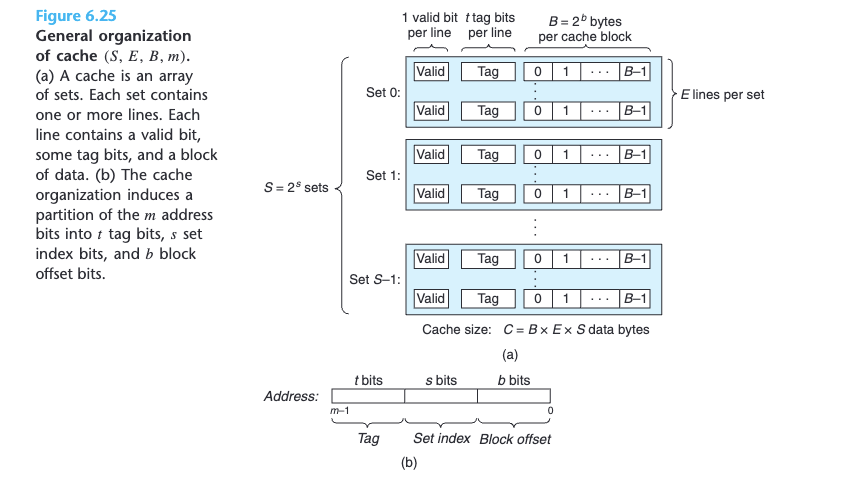
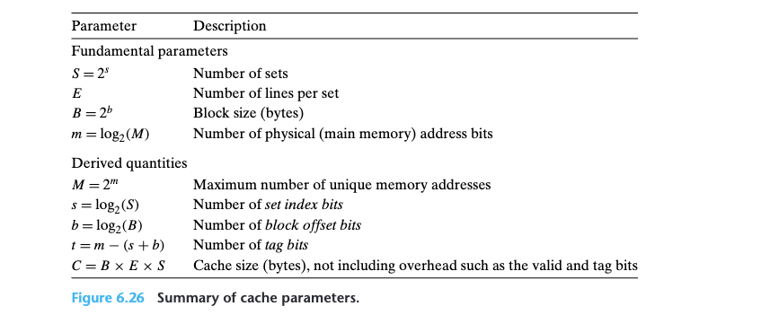
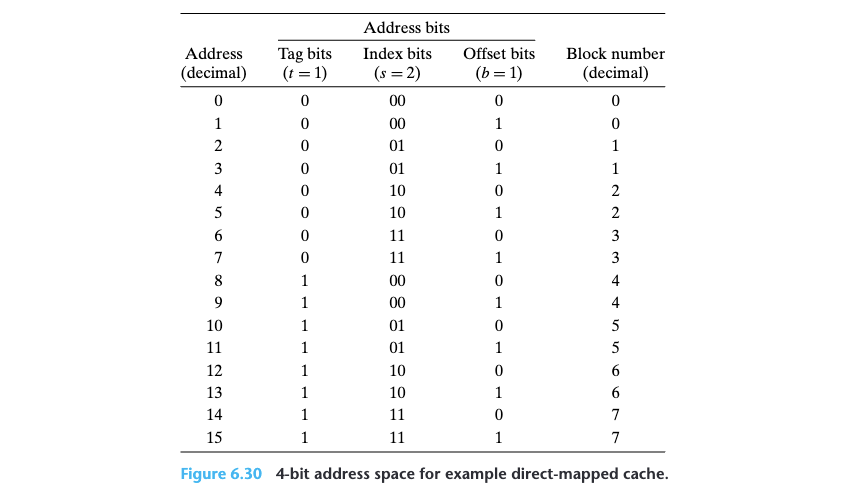

# 6 The Memory Hierarchy

Temporal locality and spatial locality

## 6.1 Storage Technologies
### 6.1.1 Random Access Memory

__Concept__
* cache = cache memory 
* _Random access memory_ (RAM)
* _Static RAM_: Stores each bit in a bistable memory cell. Each cell is implemented with a six-transistor circuit. This circuit has the property that it can stay indefinitely in either of two different voltage configurations, or states.
* _Dynamic RAM_: Stores each bit as charge on a capacitor. This capacitor is very small—typically around 30 femtofarads—that is, 30 × 10−15 farads. DRAM storage can be made very dense—each cell consists of a capacitor and a single access transistor. Unlike SRAM, however, a DRAM memory cell is very sensitive to any disturbance. When the capacitor voltage is disturbed, it will never recover. Exposure to light rays will cause the capacitor voltages to change.

__Conventional DRAMs__

* The cells (__bits__) in a DRAM chip are partitioned into `d` __supercells__
* Each __supercell__ consisting of `w` __DRAM cells__.
* A `d × w` DRAM stores a total of `dw` bits of information.
* The supercells are organized as a rectangular array with `r` rows and `c` columns, where `rc = d`.
* Each supercell has an address of the form `(i, j)`, where `i` denotes the row
and `j` denotes the column.


Information flows in and out of the chip via external connectors called pins. Each pin carries a 1-bit signal. __Figure 6.3__ shows two of these sets of pins: eight data pins that can transfer 1 byte in or out of the chip, and two addr pins that carry two-bit row and column supercell addresses. Other pins that carry control information are not shown.

* Each DRAM chip is connected to some circuitry, known as the _memory
controller_
* It can transfer `w` bits at a time to and from each DRAM chip (a supercell)
* To read the contents of supercell `(i, j)`, the memory controller sends the row address `i` to the DRAM, followed by the column address `j`. The DRAM responds by sending the contents of supercell `(i, j)` back to the controller.
* The row address i is called a __RAS (row access strobe)__ request. The column address j is called a CAS (column access strobe) request.. Notice that the RAS and CAS requests share the same DRAM address pins.


For example, to read supercell `(2, 1)` from the `16 × 8` DRAM in __Figure 6.3__, the
memory controller sends row address `2`, as shown in __Figure 6.4(a)__. The DRAM responds by copying the entire contents of row `2` into an internal row buffer. Next, the memory controller sends column address `1`, as shown in __Figure 6.4(b)__. The DRAM responds by copying the `8` bits in supercell `(2, 1)` from the row buffer and sending them to the memory controller

One reason circuit designers organize DRAMs as two-dimensional arrays instead of linear arrays is to reduce the number of address pins on the chip. For example, if our example 128-bit DRAM were organized as a linear array of 16 supercells with addresses 0 to 15, then the chip would need four address pins instead of two. The disadvantage of the two-dimensional array organization is that addresses must be sent in two distinct steps, which increases the access time.


__Memory Modules__

DRAM chips are packaged in memory modules that plug into expansion slots on
the main system board (motherboard). Core i7 systems use the `240-pin` __dual inline memory module (DIMM)__,which transfers data to and from the memory controller in `64-bit` chunks.

__Figure 6.5__ shows the basic idea of a memory module. The example module
stores a total of 64 MB (megabytes) using eight 64-Mbit 8M × 8 DRAM chips,
numbered 0 to 7. Each supercell stores 1 byte of main memory, and each __64-bit
word at byte address `A` in main memory is represented by the eight supercells
whose corresponding supercell address is `(i, j)`__. In the example in __Figure 6.5__, DRAM 0 stores the first (lower-order) byte, DRAM 1 stores the next byte, and so on.

To retrieve the word at memory address `A`, the memory controller converts
A to a supercell address (i, j ) and sends it to the memory module, which then broadcasts i and j to each DRAM. In response, each DRAM outputs the 8-bit contents of its (i, j ) supercell. Circuitry in the module collects these outputs and forms them into a 64-bit word, which it returns to the memory controller.

Main memory can be aggregated by connecting multiple memory modules to the memory controller. In this case, when the controller receives an address A, the controller selects the module k that contains A, converts A to its (i, j ) form, and sends (i, j ) to module k.

__Enhanced DRAMs__

Read the book.

__Nonvolatile Memory__

Read the book.

__Accessing Main Memory__

* Data flows back and forth between the processor and the DRAM main memory
over shared electrical conduits called **buses**.
* Each transfer of data between the
CPU and memory is accomplished with a series of steps called a **bus transaction**.
* A **read transaction** transfers data from the main memory to the CPU. A **write
transaction** transfers data from the CPU to the main memory.

A __bus__ is a collection of parallel wires that carry address, data, and control
signals. Depending on the particular bus design, data and address signals can share
the same set of wires or can use different sets. Also, more than two devices can
share the same bus. The control wires carry signals that synchronize the transaction
and identify what kind of transaction is currently being performed.

Read book for the rest.


### 6.1.2 Disk Storage

Read the book.

### 6.1.3 Solid State Disks

Read the book.

## 6.2 Locality

### 6.2.2 Locality of Instruction Fetches

Since program instructions are stored in memory and must be fetched (read)
by the CPU, we can also evaluate the locality of a program with respect to its
instruction fetches.

An important property of code that distinguishes it from program data is
that it is rarely modified at run time. While a program is executing, the CPU
reads its instructions from memory. The CPU rarely overwrites or modifies these
instructions.
### 6.2.3 Summary of Locality

Read the book


## 6.3 The Memory Hierarchy


### 6.3.1 Caching in the Memory Hierarchy

**In general, a cache (pronounced “cash”) is a small, fast storage device that acts as a staging area for the data objects stored in a larger, slower device. The process of using a cache is known as caching (pronounced “cashing”).**

**The central idea of a memory hierarchy is that for each `k`, the faster and smaller storage device at level `k` serves as a cache for the larger and slower storage device at level `k + 1`. In other words, each level in the hierarchy caches data objects from the next lower level. For example, the local disk serves as a cache for files (such as Web pages) retrieved from remote disks over the network, the main memory serves as a cache for data on the local disks, and so on, until we get to the smallest cache of all, the set of CPU registers.**


Data are always copied back and forth between level k and level k + 1 in
block-size transfer units. It is important to realize that while the block size is fixed
between any particular pair of adjacent levels in the hierarchy, other pairs of levels
can have different block sizes. For example, in Figure 6.21, transfers between L1
and L0 typically use word-size blocks. Transfers between L2 and L1 (and L3 and
L2, and L4 and L3) typically use blocks of tens of bytes

__Kinds of Cache Misses__

Whenever there is a miss, the cache at level k must implement some placement
policy that determines where to place the block it has retrieved from level k + 1. The most flexible placement policy is to allow any block from level k + 1 to be stored in any block at level k. For caches high in the memory hierarchy (close to the CPU) that are implemented in hardware and where speed is at a premium, this policy is usually too expensive to implement because randomly placed blocks are expensive to locate.

Thus, hardware caches typically implement a simpler placement policy that restricts a particular block at level k + 1 to a small subset (sometimes a singleton) of the blocks at level k. For example, in Figure 6.22, we might decide that a block i at level k + 1 must be placed in block (i mod 4) at level k. For example, blocks 0, 4, 8, and 12 at level k + 1 would map to block 0 at level k; blocks 1, 5, 9, and 13 would map to block 1; and so on. Notice that our example cache in Figure 6.22 uses this policy.

Restrictive placement policies of this kind lead to a type of miss known as a conflict miss, in which the cache is large enough to hold the referenced data objects, but because they map to the same cache block, the cache keeps missing. For example, in Figure 6.22, if the program requests block 0, then block 8, then block 0, then block 8, and so on, each of the references to these two blocks would miss in the cache at level k, even though this cache can hold a total of four blocks.

Programs often run as a sequence of phases (e.g., loops) where each phase accesses some reasonably constant set of cache blocks. For example, a nested loop might access the elements of the same array over and over again. This set of blocks is called the working set of the phase. When the size of the working set exceeds the size of the cache, the cache will experience what are known as capacity misses. In other words, the cache is just too small to handle this particular working set.


**Cache Management**

As we have noted, the essence of the memory hierarchy is that the storage device at each level is a cache for the next lower level. At each level, some form of logic must manage the cache. By this we mean that something has to partition the cache storage into blocks, transfer blocks between different levels, decide when there are hits and misses, and then deal with them. The logic that manages the cache can be hardware, software, or a combination of the two.


For example, the compiler manages the register file, the highest level of the cache hierarchy. It decides when to issue loads when there are misses, and determines which register to store the data in. The caches at levels L1, L2, and L3 are managed entirely by hardware logic built into the caches. In a system with virtual memory, the DRAM main memory serves as a cache for data blocks stored on disk, and is managed by a combination of operating system software and address translation hardware on the CPU. For a machine with a distributed file system such as AFS, the local disk serves as a cache that is managed by the AFS client process running on the local machine. In most cases, caches operate automatically and do not require any specific or explicit actions from the program.


## 6.4 Cache Memories


The memory hierarchies of early computer systems consisted of only three levels: CPU registers, main memory, and disk storage. However, because of the increasing gap between CPU and main memory, system designers were compelled to insert a small SRAM cache memory, called an L1 cache (level 1 cache) between the CPU register file and main memory, as shown in Figure 6.24. The L1 cache can be accessed nearly as fast as the registers, typically in about 4 clock cycles.

As the performance gap between the CPU and main memory continued to increase, system designers responded by inserting an additional larger cache, called an L2 cache, between the L1 cache and main memory, that can be accessed in about 10 clock cycles. Many modern systems include an even larger cache, called an L3 cache, which sits between the L2 cache and main memory in the memory hierarchy and can be accessed in about 50 cycles. While there is considerable variety in the arrangements, the general principles are the same. For our discussion in the next section, we will assume a simple memory hierarchy with a single L1 cache between the CPU and main memory.

### 6.4.1 Generic Cache Memory Organization



* Consider a computer system where each memory address has $m$ bits that form
$M = 2^m$ unique addresses
* As illustrated in **Figure 6.25(a)**, a cache for such a machine is organized as an array of $S = 2^s$ cache sets.
* Each set consists of $E$ cache lines.
* Each line consists of a data block of $B = 2^b$ bytes, a valid bit that indicates whether or not the line contains meaningful information, and $t = m − (b + s)$ tag bits (a subset of the bits from the current block’s memory address) that uniquely identify the block stored in the cache line.

In general, a cache’s organization can be characterized by the tuple $(S, E,
B, m)$. The size (or capacity) of a cache, $C$, is stated in terms of the aggregate size of all the blocks. The tag bits and valid bit are not included. Thus, $C = S × E × B$.

When the CPU is instructed by a load instruction to read a word from address `A` of main memory, it sends address `A` to the cache. If the cache is holding a copy of the word at address `A`, it sends the word immediately back to the CPU. So how does the cache know whether it contains a copy of the word at address `A`? The cache is organized so that it can find the requested word by simply inspecting the bits of the address, similar to a hash table with an extremely simple hash function. Here is how it works:

The parameters $S$ and $B$ induce a partitioning of the m address bits into the
three fields shown in __Figure 6.25(b)__. The s set index bits in `A` form an index into the array of $S$ sets. The first set is set 0, the second set is set 1, and so on. When interpreted as an unsigned integer, the __set index bits__ tell us which set the word must be stored in. Once we know which set the word must be contained in, the __t tag bits__ in `A` tell us which line (if any) in the set contains the word. __A line in the set contains the word if and only if the valid bit is set and the tag bits in the line match the tag bits in the address `A`__. Once we have located the line identified by the tag in the set identified by the set index, then the __b block offset bits__ give us the offset of the word in the B-byte data block.



### 6.4.2 Direct-Mapped Caches


Caches are grouped into different classes based on $E$, the number of cache lines per set. A cache with exactly one line per set ($E = 1$) is known as a direct-mapped cache (see __Figure 6.27__).

Suppose we have a system with a CPU, a register file, an L1 cache, and a main memory. When the CPU executes an instruction that reads a memory word `w`, it requests the word from the L1 cache. If the L1 cache has a cached copy of w, then we have an L1 cache hit, and the cache quickly extracts w and returns it to the CPU. Otherwise, we have a cache miss, and the CPU must wait while the L1 cache requests a copy of the block containing w from the main memory. When the requested block finally arrives from memory, the L1 cache stores the block in one of its cache lines, extracts word `w` from the stored block, and returns it to the CPU. The process that a cache goes through of determining whether a request is a hit or a miss and then extracting the requested word consists of three steps: __(1) set selection, (2) line matching, and (3) word extraction.__


If the cache misses, then it needs to retrieve the requested block from the next level in the memory hierarchy and store the new block in one of the cache lines of the set indicated by the set index bits. In general, if the set is full of valid cache lines, then one of the existing lines must be evicted. For a direct-mapped cache, where each set contains exactly one line, the replacement policy is trivial: the current line is replaced by the newly fetched line.

**Putting It Together: A Direct-Mapped Cache in Action**

Suppose we have a direct-mapped cache described by

$(S, E, B, m) = (4, 1, 2, 4)$

The cache has four sets, one line per set, 2 bytes per block, and 4-bit addresses. We will also assume that each word is a single byte.



* The concatenation of the tag and set index bits uniquely identifies each block in memory.
* Since there are eight memory blocks but only four cache sets, multiple blocks map to the same cache set (i.e., they have the same set index). For example, blocks 0 and 4 both map to set 0, blocks 1 and 5 both map to set 1, and so on.
* Blocks that map to the same cache set are uniquely identified by the tag.

**Putting It Together: A Direct-Mapped Cache in Action**

Read book.

**Conflict Misses in Direct-Mapped Caches**

Read book.

**Why index with the middle bits?**

If the high-order bits are used as an index, then some contiguous memory blocks will map to the same cache set. For example, in the figure, the first four blocks map to the first cache set, the second four blocks map to the second set, and so on. **If a program has good spatial locality and scans the elements of an array sequentially, then the cache can only hold a block-size chunk of the array at any point in time. This is an inefficient use of the cache.** Contrast this with middle-bit indexing, where adjacent blocks always map to different cache sets. In this case, the cache can hold an entire C-size chunk of the array, where C is the cache size.


### 6.4.3 Set Associative Caches

Read book

### 6.4.4 Fully Associative Caches

Read book (TLB involved)

### 6.4.5 Issues with Writes

Read book

### 6.4.6 Anatomy of a Real Cache Hierarchy

Read book 

### 6.4.7 Performance Impact of Cache Parameters

Read book


## 6.5 Writing Cache-Friendly Code

In general, if a cache has a block size of $B$ bytes, then a `stride-k` reference pattern (where $k$ is expressed in words) results in an average of
$min (1, (word size × k)/B)$ misses per loop iteration. 

## 6.6 Putting It Together: The Impact of Cache on Program Performance

Carefully read book!

**MY ASIDE:**
* **Q p678:** Once the stride reaches eight 8-byte words, which on
this system equals the block size of 64 bytes, every read request misses in L2 and
must be served from L3.
* **A:** Assume a cold start -> fetch first element in set $x$(miss) -> retrieve a block from L3 -> add up stride (which is 8) -> fetch second element in set $x+1$(miss and no longer use element in set $x$) -> retrieve a block from L3 -> keeping missing -> fucked up


```python

```
