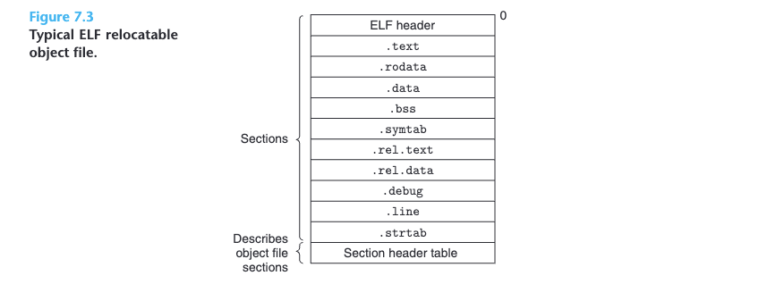
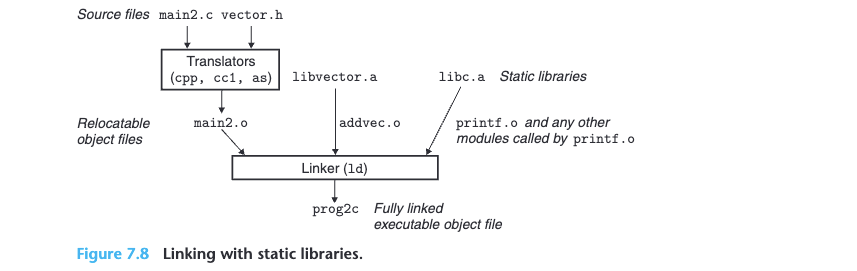
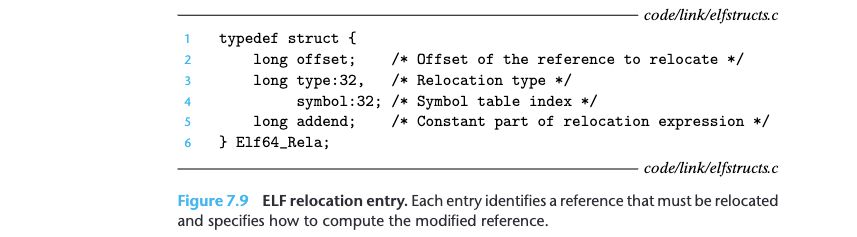
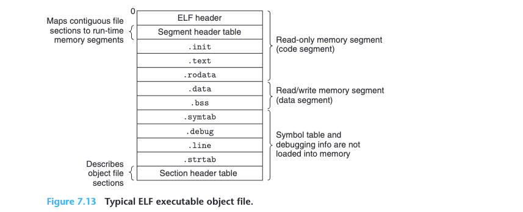
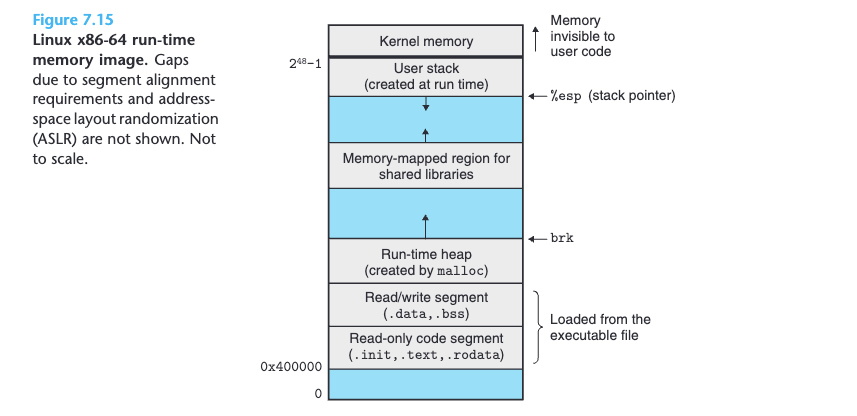
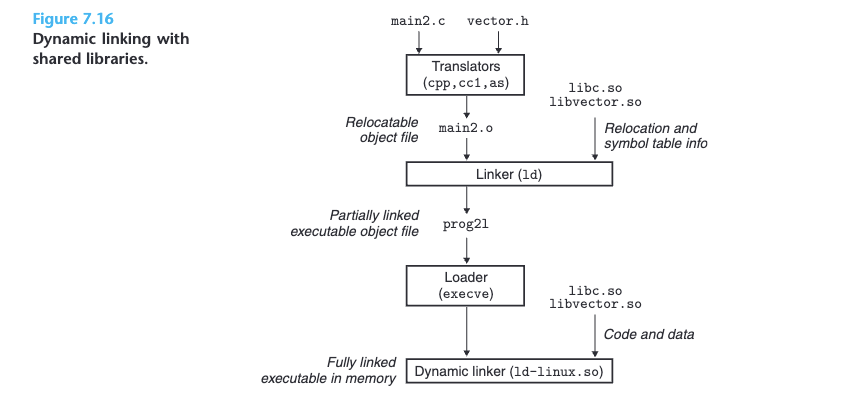

# 7 Linking

## 7.1 Compiler Drivers
Read book

## 7.2 Static Linking

_Static linkers_ such as the Linux ld program take as input a collection of relocatable
object files and command-line arguments and generate as output a fully linked
executable object file that can be loaded and run.

To build the executable, the linker must perform two main tasks:
* _Step 1. Symbol resolution._ Object files define and reference symbols, where each
symbol corresponds to a function, a global variable, or a static variable
(i.e., any C variable declared with the static attribute). **The purpose of
symbol resolution is to associate each symbol reference with exactly one
symbol definition.**

* _Step 2. Relocation._ Compilers and assemblers generate code and data sections
that start at address 0. The linker relocates these sections by associating a
memory location with each symbol definition, and then modifying all of
the references to those symbols so that they point to this memory location.
**The linker blindly performs these relocations using detailed instructions,
generated by the assembler, called relocation entries.**


## 7.3 Object Files

Object files come in three forms:
* _Relocatable object file._ Contains binary code and data in a form that can be
combined with other relocatable object files at compile time to create an
executable object file.

* _Executable object file._ Contains binary code and data in a form that can be
copied directly into memory and executed.
* _Shared object file._ A special type of relocatable object file that can be loaded
into memory and linked dynamically, at either load time or run time.


## 7.4 Relocatable Object Files



**Figure 7.3** shows the format of a typical ELF relocatable object file. The ELF header begins with a 16-byte sequence that describes the word size and byte ordering of the system that generated the file. The rest of the ELF header contains information that allows a linker to parse and interpret the object file. This includes:
* the size of the ELF header,
* the object file type (e.g., relocatable, executable, or shared), the machine type (e.g., x86-64),
* the file offset of the section header table,
* and the size and number of entries in the section header table.

The locations and sizes of the various sections are described by the section header table, which contains a fixed-size entry for each section in the object file.

A typical ELF relocatable object file contains the following
sections:
* _.text_ The machine code of the compiled program.
* _.rodata_ Read-only data such as the format strings in printf statements, and
jump tables for switch statements.
* _.data_ Initialized global and static C variables. Local C variables are maintained
at run time on the stack and do not appear in either the .data or .bss
sections.
* _.bss_ Uninitialized global and static C variables, along with any global or static
variables that are initialized to zero. This section occupies no actual space
in the object file; it is merely a placeholder. Object file formats distinguish
between initialized and uninitialized variables for space efficiency: uninitialized variables do not have to occupy any actual disk space in the object
file. At run time, these variables are allocated in memory with an initial
value of zero.
* _.symtab_ A symbol table with information about functions and global variables
that are defined and referenced in the program. Some programmers mis-
takenly believe that a program must be compiled with the -g option to
get symbol table information. In fact, every relocatable object file has
a symbol table in .symtab (unless the programmer has specifically re-
moved it with the strip command). However, unlike the symbol table
inside a compiler, the .symtab symbol table does not contain entries for
local variables.
* _.rel.text_ A list of locations in the .text section that will need to be modified
when the linker combines this object file with others. In general, any
instruction that calls an external function or references a global variable
will need to be modified. On the other hand, instructions that call local
functions do not need to be modified. Note that relocation information
is not needed in executable object files, and is usually omitted unless the
user explicitly instructs the linker to include it.
* _.rel.data_ Relocation information for any global variables that are referenced
or defined by the module. In general, any initialized global variable whose
initial value is the address of a global variable or externally defined func-
tion will need to be modified.
* _.debug_ A debugging symbol table with entries for local variables and typedefs
defined in the program, global variables defined and referenced in the
program, and the original C source file. It is only present if the compiler
driver is invoked with the -g option.
* _.line_ A mapping between line numbers in the original C source program and
machine code instructions in the .text section. It is only present if the
compiler driver is invoked with the -g option.
* _.strtab_ A string table for the symbol tables in the .symtab and .debug sec-
tions and for the section names in the section headers. A string table is a
sequence of null-terminated character strings.

## 7.5 Symbols and Symbol Tables

Each relocatable object module, m, has a symbol table that contains information
about the symbols that are defined and referenced by m. In the context of a linker,
there are three different kinds of symbols:

* Global symbols that are defined by module m and that can be referenced by
other modules. Global linker symbols correspond to nonstatic C functions and
global variables.
* Global symbols that are referenced by module m but defined by some other
module. Such symbols are called externals and correspond to nonstatic C
functions and global variables that are defined in other modules.
* Local symbols that are defined and referenced exclusively by module m. These
correspond to static C functions and global variables that are defined with the
static attribute. These symbols are visible anywhere within module m, but
cannot be referenced by other modules.

The distinction between COMMON and .bss is subtle. Modern versions of
gcc assign symbols in relocatable object files to COMMON and .bss using the
following convention:
* _COMMON_ Uninitialized global variables
* _.bss_ Uninitialized static variables, and global or static variables that are
initialized to zero

## 7.6 Symbol Resolution
### 7.6.1 How Linkers Resolve Duplicate Symbol Names

At compile time, the compiler exports each global symbol to the assembler
as either strong or weak, and the assembler encodes this information implicitly
in the symbol table of the relocatable object file. Functions and initialized global
variables get strong symbols. Uninitialized global variables get weak symbols.

Given this notion of strong and weak symbols, Linux linkers use the following
rules for dealing with duplicate symbol names:
* Rule 1. Multiple strong symbols with the same name are not allowed.
* Rule 2. Given a strong symbol and multiple weak symbols with the same name,
choose the strong symbol.
* Rule 3. Given multiple weak symbols with the same name, choose any of the
weak symbols.

**if $x$ is initialized to zero, then it is a strong symbol**

When the compiler is translating some module and encounters a weak global symbol, say, $x$, it does not know if other modules also define $x$, and if so, it cannot predict which of the multiple instances of $x$ the linker might choose. So the compiler defers the decision to the linker by assigning $x$ to `COMMON`. On the other hand, if $x$ is initialized to zero, then it is a strong symbol so the compiler can confidently assign it to `.bss`.

### 7.6.2 Linking with Static Libraries

_Static library_ be supplied as input to the linker. When it builds the output executable, the linker copies only the object modules in the library that are referenced by the application program.

To create a static library of these functions, we would use the ar tool as follows:
```
linux> gcc -c addvec.c multvec.c
linux> ar rcs libvector.a addvec.o multvec.o
```
To use the library:
```
linux> gcc -c main2.c
linux> gcc -static -o prog2c main2.o ./libvector.a
```
or equivalently,
```
linux> gcc -c main2.c
linux> gcc -static -o prog2c main2.o -L. -lvector
```


**Figure 7.8** summarizes the activity of the linker. The `-static` argument tells the
compiler driver that the linker should build a fully linked executable object file
that can be loaded into memory and run without any further linking at load time.
The `-lvector` argument is a shorthand for `libvector.a`, and the `-L. argument`
tells the linker to look for `libvector.a` in the current directory.

### 7.6.3 How Linkers Use Static Libraries to Resolve References
During the symbol resolution phase, the linker scans the relocatable object files and archives left to right in the same sequential order that they appear on the compiler driver’s command line. (The driver automatically translates any `.c` files on the command line into `.o` files.) During this scan, the linker maintains a set $E$ of relocatable object files that will be merged to form the executable, a set $U$ of unresolved symbols (i.e., symbols referred to but not yet defined), and a set $D$ of symbols that have been defined in previous input files. Initially, $E$, $U$ , and $D$ are empty.
* For each input file `f` on the command line, the linker determines if `f` is an
object file or an archive. If `f` is an object file, the linker adds `f` to $E$, updates
$U$ and $D$ to reflect the symbol definitions and references in `f` , and proceeds
to the next input file.
* If `f` is an archive, the linker attempts to match the unresolved symbols in $U$
against the symbols defined by the members of the archive. If some archive
member `m` defines a symbol that resolves a reference in $U$ , then `m` is added
to $E$, and the linker updates $U$ and $D$ to reflect the symbol definitions and
references in `m`. This process iterates over the member object files in the
archive until a fixed point is reached where $U$ and $D$ no longer change. At
this point, any member object files not contained in $E$ are simply discarded
and the linker proceeds to the next input file.
* If $U$ is nonempty when the linker finishes scanning the input files on the
command line, it prints an error and terminates. Otherwise, it merges and
relocates the object files in $E$ to build the output executable file.

Unfortunately, this algorithm can result in some baffling link-time errors
because the ordering of libraries and object files on the command line is significant.
If the library that defines a symbol appears on the command line before the object
file that references that symbol, then the reference will not be resolved and linking
will fail.

The general rule for libraries is to place them at the end of the command
line. If the members of the different libraries are independent, in that no member
references a symbol defined by another member, then the libraries can be placed
at the end of the command line in any order. If, on the other hand, the libraries
are not independent, then they must be ordered so that for each symbol `s` that
is referenced externally by a member of an archive, at least one definition of `s`
follows a reference to `s` on the command line.

**Alternatively, we could combine multiple libraries into a single archive.**

## 7.7 Relocation

Once the linker has completed the symbol resolution step, it has associated each
symbol reference in the code with exactly one symbol definition At this point, the linker knows the exact sizes of the code and data sections in its input object modules. It is now ready to begin the relocation step, where it merges the input modules and assigns run-time addresses to each symbol. Relocation consists of two steps:

1. _Relocating sections and symbol definitions._ In this step, the linker merges all sections of the same type into a new aggregate section of the same type. For example, the `.data` sections from the input modules are all merged into one section that will become the `.data` section for the output executable object file. The linker then assigns run-time memory addresses to the **new aggregate sections**, to **each section** defined by the input modules, and to **each symbol** defined by the input modules. When this step is complete, each instruction and global variable in the program has a unique run-time memory address.

2. _Relocating symbol references within sections._ In this step, the linker modifies **every symbol reference** in the bodies of the code and data sections so that they point to the correct run-time addresses. To perform this step, the linker relies on data structures in the relocatable object modules known as relocation entries, which we describe next.

### 7.7.1 Relocation Entries
When an assembler generates an object module, it does not know where the code
and data will ultimately be stored in memory. Nor does it know the locations of
any externally defined functions or global variables that are referenced by the
module. So whenever the assembler encounters a reference to an object whose
ultimate location is unknown, it generates a relocation entry that tells the linker
how to modify the reference when it merges the object file into an executable.
Relocation entries for code are placed in `.rel.text`. Relocation entries for data
are placed in `.rel.data`.

**Figure 7.9** shows the format of an ELF relocation entry. The `offset` is the section offset of the reference that will need to be modified. The `symbol` identifies the symbol that the modified reference should point to. The `type` tells the linker how to modify the new reference. The `addend` is a signed constant that is used by some types of relocations to bias the value of the modified reference.



ELF defines 32 different relocation types, many quite arcane. We are con-
cerned with only the two most basic relocation types:

* `R_X86_64_PC32`. Relocate a reference that uses a 32-bit PC-relative address. Recall from Section 3.6.3 that a PC-relative address is an offset from the current run-time value of the program counter (PC). When the CPU executes an instruction using PC-relative addressing, it forms the effective address (e.g., the target of the call instruction) by adding the 32-bit value encoded in the instruction to the current run-time value of the PC, which is always the address of the next instruction in memory.

* `R_X86_64_32`. Relocate a reference that uses a 32-bit absolute address. With
absolute addressing, the CPU directly uses the 32-bit value encoded in
the instruction as the effective address, without further modifications.

These two relocation types support the x86-64 small code model, which assumes that the total size of the code and data in the executable object file is smaller than 2 GB, and thus can be accessed at run-time using 32-bit PC-relative addresses. The small code model is the default for gcc. Programs larger than 2 GB can be compiled using the `-mcmodel=medium` (medium code model) and `-mcmodel=large` (large code model) flags

### 7.7.2 Relocating Symbol References
 Read the book

## 7.8 Executable Object Files



**Read book for the rest**

## 7.9 Loading Executable Object Files



**Read book for the rest**

## 7.10 Dynamic Linking with Shared Libraries

Shared libraries are modern innovations that address the disadvantages of
static libraries. A shared library is an object module that, at either run time or load time, can be loaded at an arbitrary memory address and linked with a program in memory. This process is known as dynamic linking and is performed by a program called a dynamic linker. Shared libraries are also referred to as shared objects.

Shared libraries are “shared” in two different ways. First, in any given file system, there is exactly one `.so` file for a particular library. The code and data in this `.so` file are shared by all of the executable object files that reference the library, as opposed to the contents of static libraries, which are copied and embedded in the executables that reference them. Second, a single copy of the `.text` section of a shared library in memory can be shared by different running processes. 



**Figure 7.16** summarizes the dynamic linking process. To build a shared library `libvector.so`, we invoke the compiler driver with some special directives
to the compiler and linker:
```
linux> gcc -shared -fpic -o libvector.so addvec.c multvec.c
```
* The `-fpic` flag directs the compiler to generate position-independent code
* The `-shared` flag directs the linker to create a shared object file.

Once we have created the library, we would then link it:
```
linux> gcc -o prog2l main2.c ./libvector.so
```
The basic idea is to do some of the linking statically when the executable file is created, and then complete the linking process dynamically when the program is loaded. It is important to realize that none of the code or data sections from `libvector.so` are actually copied into the executable prog2l at this point. Instead, the linker copies some relocation and symbol table information that will allow references to code and data in `libvector.so` to be resolved at load time.

When the loader loads and runs the executable `prog2l`, it loads the partially
linked executable prog2l. Next, it
notices that `prog2l` contains a `.interp` section, which contains the path name of
the dynamic linker, which is itself a shared object (e.g., `ld-linux.so` on Linux
systems). Instead of passing control to the application, as it would normally do,
the loader loads and runs the dynamic linker. The dynamic linker then finishes the
linking task by performing the following relocations:
* Relocating the text and data of `libc.so` into some memory segment
* Relocating the text and data of `libvector.so` into another memory segment
* Relocating any references in `prog2l` to symbols defined by `libc.so` and
`libvector.so`

**Finally, the dynamic linker passes control to the application. From this point on, the locations of the shared libraries are fixed and do not change during execution of the program.**

## 7.11 Loading and Linking Shared Libraries from Applications

Up to this point, we have discussed the scenario in which the dynamic linker loads
and links shared libraries when an application is loaded, just before it executes.

However, it is also possible for an application to request the dynamic linker to
load and link arbitrary shared libraries while the application is running, without
having to link in the applications against those libraries at compile time.

Linux systems provide a simple interface to the dynamic linker that allows
application programs to load and link shared libraries at run time.

**Read book for the rest**

## 7.12 Position-Independent Code (PIC)

Read the book


## 7.13 Library Interpositioning

Read the book


## 7.14 Tools for Manipulating Object Files

There are a number of tools available on Linux systems to help you understand
and manipulate object files. In particular, the GNU binutils package is especially
helpful and runs on every Linux platform.
* ar. Creates static libraries, and inserts, deletes, lists, and extracts members.
* strings. Lists all of the printable strings contained in an object file.
* strip. Deletes symbol table information from an object file.
* nm. Lists the symbols defined in the symbol table of an object file.
* size. Lists the names and sizes of the sections in an object file.
* readelf. Displays the complete structure of an object file, including all of the
information encoded in the ELF header. Subsumes the functionality of
size and nm.
* objdump. The mother of all binary tools. Can display all of the information in an object file. Its most useful function is disassembling the binary instructions
in the .text section.

Linux systems also provide the ldd program for manipulating shared libraries:
* ldd: Lists the shared libraries that an executable needs at run time.


```python

```
