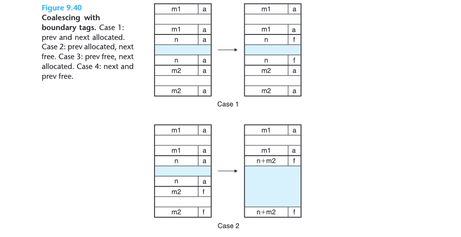

# 9 Virtual Memory

Virtual memory is an elegant interaction of hardware exceptions, hardware address translation, main memory, disk files, and kernel software that provides each process with a large, uniform, and private address space.

With one clean mechanism, virtual memory provides three important capabilities: 
1. It uses main memory efficiently by treating it as a cache for an address space stored on disk, keeping only the active areas in main memory and transferring data back and forth between disk and memory as needed.
2. It simplifies memory management by providing each process with a uniform address space.
3. It protects the address space of each process from corruption by other processes.

## 9.1 Physical and Virtual Addressing

The main memory of a computer system is organized as an array of M contiguous byte-size cells. Each byte has a unique _physical address_ (PA). The first byte has an address of 0, the next byte an address of 1, the next byte an address of 2, and so on. Given this simple organization, the most natural way for a CPU to access memory would be to use physical addresses. We call this approach _physical addressing_. **Figure 9.1** shows an example of physical addressing in the context of a load instruction that reads the 4-byte word starting at physical address 4. When the CPU executes the load instruction, it generates an effective physical address and passes it to main memory over the **memory bus**. The **main memory** fetches the 4-byte word starting at physical address 4 and returns it to the CPU, which stores it in a register.


With virtual addressing, the CPU accesses main memory by generating a _virtual address (VA)_, which is converted to the appropriate physical address before being sent to main memory. The task of converting a virtual address to a physical one is known as _address translation_. Dedicated hardware on the CPU chip called the _memory management unit (MMU)_ translates virtual addresses **on the fly**, using a lookup table stored in main memory whose contents are managed by the operating system.


## 9.2 Address Spaces

An _address space_ is an ordered set of nonnegative integer addresses: $\{0, 1, 2, ...\}$

If the integers in the address space are consecutive, then we say that it is a _linear address space_. To simplify our discussion, we will always assume linear address spaces. In a system with virtual memory, the CPU generates virtual addresses from an address space of $N = 2^n$ addresses called the _virtual address space_: $\{0, 1, 2, ..., N\}$

A system also has a _physical address space_ that corresponds to the $M$ bytes of physical memory in the system: $\{0, 1, 2, ..., M-1\}$, $M$ is not required to be a power of 2, but to simplify the discussion, we will assume that $M = 2^m$.

Each byte of main memory has a virtual address chosen from the virtual address space, and a physical address chosen from the physical address space.


## 9.3 VM as a Tool for Caching

Conceptually, a virtual memory is organized as an array of $N$ contiguous byte-size
cells stored on disk. Each byte has a unique virtual address that serves as an index
into the array. The contents of the array on disk are cached in main memory. As
with any other cache in the memory hierarchy, the data on disk (the lower level)
is partitioned into blocks that serve as the transfer units between the disk and
the main memory (the upper level). VM systems handle this by partitioning the virtual memory into fixed-size blocks called _virtual pages (VPs)_. Each virtual page is $P = 2^p$ bytes in size. Similarly, physical memory is partitioned into _physical pages (PPs)_, also $P$ bytes in size. (Physical pages are also referred to as _page frames_.)

At any point in time, the set of virtual pages is partitioned into three disjoint
subsets:
* _Unallocated._ Pages that have not yet been allocated (or created) by the VM system. Unallocated blocks do not have any data associated with them, and thus do not occupy any space on disk.
* _Cached._ Allocated pages that are currently cached in physical memory.
* _Uncached._ Allocated pages that are not cached in physical memory.

The example in **Figure 9.3** shows a small virtual memory with eight virtual
pages. Virtual pages 0 and 3 have not been allocated yet, and thus do not yet exist
on disk. Virtual pages 1, 4, and 6 are cached in physical memory. Pages 2, 5, and 7
are allocated but are not currently cached in physical memory.


### 9.3.1 DRAM Cache Organization

To help us keep the different caches in the memory hierarchy straight, we will use
the term _SRAM cache_ to denote the L1, L2, and L3 cache memories between the
CPU and main memory, and the term _DRAM cache_ to denote the VM system’s
cache that caches virtual pages in main memory.

Because of the large miss penalty and the expense of accessing the first byte from disk, virtual pages tend to be large—typically 4 KB to 2 MB. Due to the large miss penalty, DRAM caches are fully associative; **that is, any virtual page can be placed in any physical page**.

The replacement policy on misses also assumes greater importance, because the penalty associated with replacing the wrong virtual page is so high. Thus, operating systems use much more sophisticated replacement algorithms for DRAM caches than the hardware does for SRAM caches. Finally, because of the large access time of disk, DRAM caches always use write-back instead of write-through.

### 9.3.2 Page Tables

As with any cache, the VM system must have some way to determine if a virtual
page is cached somewhere in DRAM. If so, the system must determine which
physical page it is cached in. If there is a miss, the system must determine where the virtual page is stored on disk, select a victim page in physical memory,
and copy the virtual page from disk to DRAM, replacing the victim page.

These capabilities are provided by a combination of operating system soft-
ware, address translation hardware in the MMU (memory management unit), and
a data structure stored in physical memory known as a page table that maps vir-
tual pages to physical pages. The address translation hardware reads the page table
each time it converts a virtual address to a physical address. The operating system
is responsible for maintaining the contents of the page table and transferring pages
back and forth between disk and DRAM.

**Figure 9.4** shows the basic organization of a page table. A page table is an array
of _page table entries (PTEs)_. Each page in the virtual address space has a PTE at
a fixed offset in the page table. For our purposes, we will assume that each PTE
consists of a valid bit and an n-bit address field. The valid bit indicates whether
the virtual page is currently cached in DRAM. If the valid bit is set, the address
field indicates the start of the corresponding physical page in DRAM where the
virtual page is cached. If the valid bit is not set, then a null address indicates that
the virtual page has not yet been allocated. Otherwise, the address points to the
start of the virtual page on disk.
An important point to notice about **Figure 9.4** is that because the DRAM
cache is fully associative, any physical page can contain any virtual page.


### 9.3.3 Page Hits

Consider what happens when the CPU reads a word of virtual memory contained in VP 2, which is cached in DRAM (**Figure 9.5**). Using a technique we will describe in detail in **Section 9.6**, the address translation hardware uses the virtual address as an index to locate PTE 2 and read it from memory. Since the valid bit is set, the address translation hardware knows that VP 2 is cached in memory. So it uses the physical memory address in the PTE (which points to the start of the cached page in PP 1) to construct the physical address of the word.


### 9.3.4 Page Faults

In virtual memory parlance, a DRAM cache miss is known as a _page fault_. **Figure 9.6** shows the state of our example page table before the fault. The CPU has
referenced a word in VP 3, which is not cached in DRAM. The address transla-
tion hardware reads PTE 3 from memory, infers from the valid bit that VP 3 is
not cached, and triggers a page fault exception.

The page fault exception invokes
a page fault exception handler in the kernel, which selects a victim page—in this
case, VP 4 stored in PP 3. If VP 4 has been modified, then the kernel copies it back
to disk. In either case, the kernel modifies the page table entry for VP 4 to reflect
the fact that VP 4 is no longer cached in main memory.

Next, the kernel copies VP 3 from disk to PP 3 in memory, updates PTE 3,
and then returns. When the handler returns, it restarts the faulting instruction,
which resends the faulting virtual address to the address translation hardware.
But now, VP 3 is cached in main memory, and the page hit is handled normally by
the address translation hardware. **Figure 9.7** shows the state of our example page
table after the page fault.

Virtual memory was invented in the early 1960s, long before the widening
CPU-memory gap spawned SRAM caches. As a result, virtual memory systems
use a different terminology from SRAM caches, even though many of the ideas
are similar. In virtual memory parlance, blocks are known as pages. The activity
of transferring a page between disk and memory is known as _swapping or paging_.
Pages are _swapped in (paged in)_ from disk to DRAM, and _swapped out (paged
out)_ from DRAM to disk. The strategy of waiting until the last moment to swap in a page, when a miss occurs, is known as _demand paging_.

### 9.3.5 Allocating Pages

**Figure 9.8** shows the effect on our example page table when the operating system
allocates a new page of virtual memory—for example, as a result of calling malloc.
In the example, VP 5 is allocated by creating room on disk and updating PTE 5
to point to the newly created page on disk.


### 9.3.6 Locality to the Rescue Again

Although the total number of distinct pages that programs reference during an
entire run might exceed the total size of physical memory, the principle of locality
promises that at any point in time they will tend to work on a smaller set of active
pages known as the _working set_ or _resident set_. After an initial overhead where
the working set is paged into memory, subsequent references to the working set
result in hits, with no additional disk traffic.

As long as our programs have good temporal locality, virtual memory systems
work quite well. But of course, not all programs exhibit good temporal locality. If
the working set size exceeds the size of physical memory, then the program can
produce an unfortunate situation known as _thrashing_, where pages are swapped in
and out continuously. Although virtual memory is usually efficient, if a program’s
performance slows to a crawl, the wise programmer will consider the possibility
that it is thrashing.


## 9.4 VM as a Tool for Memory Management

Notice that multiple virtual pages can be mapped to
the same shared physical page.


The combination of demand paging and separate virtual address spaces has
a profound impact on the way that memory is used and managed in a system. In
particular, VM simplifies linking and loading, the sharing of code and data, and
allocating memory to applications.

* _Simplifying linking._ A separate address space allows each process to use the same basic format for its memory image, regardless of where the code and data actually reside in physical memory.

* _Simplifying loading._ Virtual memory also makes it easy to load executable and shared object files into memory. To load the `.text` and `.data` sections of an object file into a newly created process, the Linux loader allocates virtual pages for the code and data segments, marks them as invalid (i.e., not cached), and points their page table entries to the appropriate locations in the object file. The interesting point is that the loader never actually copies any data from disk into memory. The data are paged in automatically and on demand by the virtual memory system the first time each page is referenced, either by the CPU when it fetches an instruction or by an executing instruction when it references a memory location.

* _Simplifying sharing._ Separate address spaces provide the operating system with a consistent mechanism for managing sharing between user processes and the operating system itself. In general, each process has its own private code, data, heap, and stack areas that are not shared with any other process. In this case, the operating system creates page tables that map the corresponding virtual pages to disjoint physical pages. However, in some instances it is desirable for processes to share code and data. For example, every process must call the same operating system kernel code, and every C program makes calls to routines in the standard C library such as printf. Rather than including separate copies of the kernel and standard C library in each process, the operating system can arrange for multiple processes to share a single copy of this code by mapping the appropriate virtual pages in different processes to the same physical pages.

* _Simplifying memory allocation._ Virtual memory provides a simple mechanism
for allocating additional memory to user processes. When a program running
in a user process requests additional heap space (e.g., as a result of calling
`malloc`), the operating system allocates an appropriate number, say, $k$, of
contiguous virtual memory pages, and maps them to $k$ arbitrary physical pages
located anywhere in physical memory. Because of the way page tables work,
there is no need for the operating system to locate $k$ contiguous pages of
physical memory. The pages can be scattered randomly in physical memory.

## 9.5 VM as a Tool for Memory Protection

Any modern computer system must provide the means for the operating system
to control access to the memory system. A user process should not be allowed to modify its read-only code section. Nor should it be allowed to read or modify
any of the code and data structures in the kernel. It should not be allowed to read
or write the private memory of other processes, and it should not be allowed to
modify any virtual pages that are shared with other processes, unless all parties
explicitly allow it (via calls to explicit interprocess communication system calls).

As we have seen, providing separate virtual address spaces makes it easy to
isolate the private memories of different processes. But the address translation
mechanism can be extended in a natural way to provide even finer access control.
Since the address translation hardware reads a PTE each time the CPU generates
an address, it is straightforward to control access to the contents of a virtual page
by adding some additional permission bits to the PTE. **Figure 9.10** shows the
general idea.


In this example, we have added three permission bits to each PTE. The SUP bit
indicates whether processes must be running in kernel (supervisor) mode to access
the page. Processes running in kernel mode can access any page, but processes
running in user mode are only allowed to access pages for which SUP is 0. The
READ and WRITE bits control read and write access to the page. For example,
if process i is running in user mode, then it has permission to read VP 0 and to
read or write VP 1. However, it is not allowed to access VP 2.

If an instruction violates these permissions, then the CPU triggers a general
protection fault that transfers control to an exception handler in the kernel, which
sends a SIGSEGV signal to the offending process. Linux shells typically report this
exception as a “segmentation fault.”

## 9.6 Address Translation


In this section, we are omitting a number of details, especially related to timing, that are important to hardware designers but are beyond our scope. For your
reference, **Figure 9.11** summarizes the symbols that we will be using throughout
this section.

Address translation is a mapping between the elements of an N-
element virtual address space (VAS) and an M-element physical address space
(PAS).

**Figure 9.12** shows how the MMU uses the page table to perform this mapping.
A control register in the CPU, the page table base register (PTBR) points to the
current page table. The $n$-bit virtual address has two components: a $p$-bit virtual
page offset (VPO) and an $(n − p)$-bit virtual page number (VPN). The MMU uses
the VPN to select the appropriate PTE. For example, VPN 0 selects PTE 0, VPN 1
selects PTE 1, and so on. The corresponding physical address is the concatenation
of the physical page number (PPN) from the page table entry and the VPO from
the virtual address. **Notice that since the physical and virtual pages are both P
bytes, the physical page offset (PPO) is identical to the VPO.**


**Figure 9.13(a)** shows the steps that the CPU hardware performs when there
is a page hit.
* _Step 1._ The processor generates a virtual address and sends it to the MMU.
* _Step 2._ The MMU generates the PTE address and requests it from the cache/
main memory.
* _Step 3._ The cache/main memory returns the PTE to the MMU.
* _Step 4._ The MMU constructs the physical address and sends it to the cache/main
memory.
* _Step 5._ The cache/main memory returns the requested data word to the pro-
cessor.

Unlike a page hit, which is handled entirely by hardware, handling a page
fault requires cooperation between hardware and the operating system kernel
(**Figure 9.13(b)**).

* _Steps 1 to 3._ The same as steps 1 to 3 in Figure 9.13(a).
* _Step 4._ The valid bit in the PTE is zero, so the MMU triggers an exception,
which transfers control in the CPU to a page fault exception handler in
the operating system kernel.
* _Step 5._ The fault handler identifies a victim page in physical memory, and if that
page has been modified, pages it out to disk.
* _Step 6._ The fault handler pages in the new page and updates the PTE in memory.
* _Step 7._ The fault handler returns to the original process, causing the faulting
instruction to be restarted. The CPU resends the offending virtual address
to the MMU. Because the virtual page is now cached in physical memory,
there is a hit, and after the MMU performs the steps in **Figure 9.13(a)**, the
main memory returns the requested word to the processor.


首先，处理器生成 VA (Virtual address)并发送给 MMU (Memory management unit)，虚拟地址去除 VPO (Virtual page offset，同时也等于 Physical page offset) 后便是对应的 VPN (Virtual page number)，根据 VPN 和 page table 的地址可以 生成 PTEA (Page table entries address)。随后 MMU 根据 PTEA 到存储在内存中的 page table 中取得 PTE。PTE 中存储了 physical page number (Cached) or disk address (Not cached)。
* 如果 valid bit is set，则储存的是 physical page number，则可以直接生成 PA (Physical address)，从 main memory 中获取 data。__这种情况也被称为 page hit__。
* 如果 valid bit is not set 时，分为两种情况，如果此时 PTE 储存值为 NULL，则说明page is not allocated，说明此时程序员是在 access 没有被 allocate 的内存区域，结果自然就是 segfault。正确的方式是，1) 不使用未收集的内存 2) 使用 malloc 等函数先收集内存。
* 如果 valid bit is not set 时，PTE 储存值非 NULL，说明此时 PTE 中存储的是 disk address。此时 VP (Virtual page) 未在 main memory 中，__这种情况也被称为 page fault__，会触发内核的 page fault exception handler，handler 会选择一个 main memory 中的 victim page，如果选中的 victim page 已经被 modified，那么内核需要把它写回 disk。原本映射到 victim page 的 PTE 的 valid bit is unset (Uncached)。最后，内核把 disk address 中的数据复制到 victim page 中，set valid bit。

### 9.6.1 Integrating Caches and VM

In any system that uses both virtual memory and SRAM caches, there is the issue of whether to use virtual or physical addresses to access the SRAM cache. Although a detailed discussion of the trade-offs is beyond our scope here, most systems opt for physical addressing. With physical addressing, it is straightforward for multiple processes to have blocks in the cache at the same time and to share blocks from the same virtual pages. Further, the cache does not have to deal with protection issues, because access rights are checked as part of the address translation process.

**Figure 9.14** shows how a physically addressed cache might be integrated with virtual memory. The main idea is that the address translation occurs before the cache lookup. Notice that page table entries can be cached, just like any other data words.


### 9.6.2 Speeding Up Address Translation with a TLB

As we have seen, every time the CPU generates a virtual address, the MMU must refer to a PTE in order to translate the virtual address into a physical address. In the worst case, this requires an additional fetch from memory, at a cost of tens to hundreds of cycles. If the PTE happens to be cached in L1, then the cost goes down to a handful of cycles. However, many systems try to eliminate even this cost by including a **small cache of PTEs in the MMU** called a _translation lookaside buffer (TLB)_.


__A TLB is a small, virtually addressed cache where each line holds a block
consisting of a single PTE__. A TLB usually has a high degree of associativity. As shown in **Figure 9.15**, the index and tag fields that are used for set selection and line matching are extracted from the virtual page number in the virtual address. If the TLB has $T = 2^t$ sets, then the _TLB index (TLBI)_ consists of the $t$ least significant bits of the VPN, and the _TLB tag (TLBT)_ consists of the remaining bits in the VPN.


high degree of associativity 指较小的 $T = 2^t$，相对应的，tag 的 bit 数会偏多，这也侧面说明了 TLB 在硬件上有较好的优化，可以快速找到对应 PTE。

**Figure 9.16(a)** shows the steps involved when there is a TLB hit (the usual case). The key point here is that all of the address translation steps are performed inside the on-chip MMU and thus are fast.

* _Step 1._ The CPU generates a virtual address.
* _Steps 2 and 3._ The MMU fetches the appropriate PTE from the TLB.
* _Step 4._ The MMU translates the virtual address to a physical address and sends
it to the cache/main memory.
* _Step 5._ The cache/main memory returns the requested data word to the CPU.

When there is a TLB miss, then the MMU must fetch the PTE from the L1
cache, as shown in Figure 9.16(b). The newly fetched PTE is stored in the TLB, possibly overwriting an existing entry.

### 9.6.3 Multi-Level Page Tables

Thus far, we have assumed that the system uses a single page table to do address translation. But if we had a 32-bit address space, 4 KB pages, and a 4-byte PTE, then we would need a 4 MB page table resident in memory at all times. (page number = $2^{32}B/4KB$, page table size = page number*PTE size = $4MB$).


Below is a multi-hierarchy page table walk. 


## 9.7 Case Study: The Intel Core i7/Linux Memory System

**Figure 9.21** gives the highlights of the Core i7 memory system. The _processor package_ (chip) includes four cores, a large L3 cache shared by all of the cores, and a DDR3 memory controller. Each core contains a hierarchy of TLBs, a hierarchy of data and instruction caches, and a set of fast point-to-point links, based on the QuickPath technology, for communicating directly with the other cores and the external I/O bridge. **The TLBs are virtually addressed**, and 4-way set associative. **The L1, L2, and L3 caches are physically addressed**, with a block size of 64 bytes. L1 and L2 are 8-way set associative, and L3 is 16-way set associative. The page size can be configured at start-up time as either 4 KB or 4 MB. Linux uses 4 KB pages.


### 9.7.1 Core i7 Address Translation

**Figure 9.22** summarizes the entire Core i7 address translation process, from the
time the CPU generates a virtual address until a data word arrives from memory.
The Core i7 uses a **four-level page table hierarchy**. Each process has its own private
page table hierarchy. **When a Linux process is running, the page tables associated
with allocated pages are all memory-resident**, although the Core i7 architecture
allows these page tables to be swapped in and out. The CR3 control register
contains the physical address of the beginning of the level 1 (L1) page table. **The
value of CR3 is part of each process context, and is restored during each context
switch**.


**Figure 9.23** shows the format of an entry in a level 1, level 2, or level 3
page table. When $P = 1$ (which is always the case with Linux), the address field contains a 40-bit physical page number (PPN) that points to the beginning of the appropriate page table. Notice that this imposes a 4 KB alignment requirement on page tables.


**Figure 9.24** shows the format of an entry in a level 4 page table. When P = 1,
the address field contains a 40-bit PPN that points to the base of some page in
physical memory. Again, this imposes a 4 KB alignment requirement on physical
pages.


The XD (execute disable) bit, which was introduced in 64-bit systems, can be used to disable instruction fetches from individual memory pages. This is an important new feature that allows the operating system kernel to reduce the risk of buffer overflow attacks by restricting execution to the read-only code segment.

As the MMU translates each virtual address, it also updates two other bits that can be used by the kernel’s page fault handler. The MMU sets the A bit, which is known as a _reference bit_, each time a page is accessed. The kernel can use the reference bit to implement its page replacement algorithm. The MMU sets the D bit, or _dirty bit_, each time the page is written to. A page that has been modified is sometimes called a _dirty page_. The dirty bit tells the kernel whether or not it must write back a victim page before it copies in a replacement page. The kernel can call a special kernel-mode instruction to clear the reference or dirty bits.

**Figure 9.25** shows how the Core i7 MMU uses the four levels of page tables to translate a virtual address to a physical address. The 36-bit VPN is partitioned into four 9-bit chunks, each of which is used as an offset into a page table. The CR3 register contains the physical address of the L1 page table. VPN 1 provides an offset to an L1 PTE, which contains the base address of the L2 page table. VPN 2 provides an offset to an L2 PTE, and so on.


### 9.7.2 Linux Virtual Memory System

Linux maintains a separate virtual address space for each process of the form
shown in **Figure 9.26**. We have seen this picture a number of times already, with
its familiar code, data, heap, shared library, and stack segments. Now that we
understand address translation, we can fill in some more details about the kernel
virtual memory that lies above the user stack.


The kernel virtual memory contains the code and data structures in the kernel.
Some regions of the kernel virtual memory are mapped to physical pages that are shared by all processes. For example, each process shares the kernel’s code
and global data structures. Interestingly, Linux also maps a set of contiguous
virtual pages (equal in size to the total amount of DRAM in the system) to the
corresponding set of contiguous physical pages. This provides the kernel with a
convenient way to access any specific location in physical memory—for example,
when it needs to access page tables or to perform memory-mapped I/O operations
on devices that are mapped to particular physical memory locations.

Other regions of kernel virtual memory contain data that differ for each process. Examples include page tables, the stack that the kernel uses when it is executing code in the context of the process, and various data structures that keep track of the current organization of the virtual address space.

**Linux Virtual Memory Areas**

Linux organizes the virtual memory as a collection of _areas_ (also called _segments_). An area is a contiguous chunk of existing (allocated) virtual memory whose pages are related in some way. For example, the code segment, data segment, heap, shared library segment, and user stack are all distinct areas. Each existing virtual page is contained in some area, and any virtual page that is not part of some area does not exist and cannot be referenced by the process. **The notion of an area is important because it allows the virtual address space to have gaps**. The kernel does not keep track of virtual pages that do not exist, and such pages do not consume any additional resources in memory, on disk, or in the kernel itself.

**Figure 9.27** highlights the kernel data structures that keep track of the virtual memory areas in a process. The kernel maintains a distinct task structure (`task_struct` in the source code) for each process in the system. The elements of the task structure either contain or point to all of the information that the kernel needs to run the process (e.g., the PID, pointer to the user stack, name of the executable
object file, and program counter).


One of the entries in the task structure points to an mm_struct that charac-
terizes the current state of the virtual memory. The two fields of interest to us are `pgd`, which points to the base of the level 1 table (the page global directory), and `mmap`, which points to a list of `vm_area_structs` (area structs), each of which characterizes an area of the current virtual address space. **When the kernel runs this process, it stores pgd in the CR3 control register**.

For our purposes, the area struct for a particular area contains the following
fields:
* `fvm_start`. Points to the beginning of the area.
* `vm_end`. Points to the end of the area.
* `vm_prot`. Describes the read/write permissions for all of the pages contained in the area.
* `vm_flags`. Describes (among other things) whether the pages in the area are
shared with other processes or private to this process.
* `vm_next`. Points to the next area struct in the list.

**Linux Page Fault Exception Handling**


Suppose the MMU triggers a page fault while trying to translate some virtual
address A. The exception results in a transfer of control to the kernel’s page fault handler, which then performs the following steps:

1. Is virtual address A legal? In other words, does A lie within an area defined by some area struct? To answer this question, the fault handler searches the list of area structs, comparing A with the `vm_start` and `vm_end` in each area struct. If the instruction is not legal, then the fault handler triggers a segmentation fault, which terminates the process. This situation is labeled “1” in **Figure 9.28**. Because a process can create an arbitrary number of new virtual memory areas (using the `mmap` function described in the next section), a sequential search of the list of area structs might be very costly. So in practice, Linux superimposes a tree on the list, using some fields that we have not shown, and performs the search on this tree.
2. Is the attempted memory access legal? In other words, does the process have
permission to read, write, or execute the pages in this area? For example, was the page fault the result of a store instruction trying to write to a read- only page in the code segment? Is the page fault the result of a process running in user mode that is attempting to read a word from kernel virtual memory? If the attempted access is not legal, then the fault handler triggers a protection exception, which terminates the process. This situation is labeled “2” in **Figure 9.28**.
3. At this point, the kernel knows that the page fault resulted from a legal operation on a legal virtual address. It handles the fault by selecting a victim page, swapping out the victim page if it is dirty, swapping in the new page, and updating the page table. When the page fault handler returns, the CPU restarts the faulting instruction, which sends A to the MMU again. This time, the MMU translates A normally, without generating a page fault.

## 9.8 Memory Mapping

Linux initializes the contents of a virtual memory area by associating it with an `object` on disk, a process known as `memory mapping`. Areas can be mapped to one of two types of objects:

1. _Regular file in the Linux file system:_ An area can be mapped to a contiguous section of a regular disk file, such as an executable object file. The file section is divided into page-size pieces, with each piece containing the initial contents of a virtual page. Because of demand paging, none of these virtual pages is actually swapped into physical memory until the CPU first _touches_ the page (i.e., issues a virtual address that falls within that page’s region of the address space). **If the area is larger than the file section, then the area is padded with zeros**.

2. _Anonymous file:_ An area can also be mapped to an anonymous file, created
by the kernel, that contains all binary zeros. The first time the CPU touches
a virtual page in such an area, the kernel finds an appropriate victim page
in physical memory, swaps out the victim page if it is dirty, overwrites the
victim page with binary zeros, and updates the page table to mark the page
as resident. Notice that no data are actually transferred between disk and
memory. For this reason, pages in areas that are mapped to anonymous files
are sometimes called _demand-zero_ pages.

In either case, once a virtual page is initialized, it is swapped back and forth between a special _swap file_ maintained by the kernel. The swap file is also known as the _swap space_ or the _swap area_. An important point to realize is that at any point in time, the swap space bounds the total amount of virtual pages that can be allocated by the currently running processes.

### 9.8.1 Shared Objects Revisited

The idea of memory mapping resulted from a clever insight that if the virtual memory system could be integrated into the conventional file system, then it could provide a simple and efficient way to load programs and data into memory.

As we have seen, the process abstraction promises to provide each process with its own private virtual address space that is protected from errant writes or reads by other processes. However, many processes have identical read-only code areas. For example, each process that runs the Linux shell program bash has the same code area. Further, many programs need to access identical copies of read-only run-time library code. For example, every C program requires functions from the standard C library such as printf. It would be extremely wasteful for each process to keep duplicate copies of these commonly used codes in physical memory. Fortunately, memory mapping provides us with a clean mechanism for controlling how objects are shared by multiple processes.


Suppose that process 1 maps a shared object into an area of its virtual memory,
as shown in **Figure 9.29(a)**. Now suppose that process 2 maps the same shared object into its address space (not necessarily at the same virtual address as process 1), as shown in Figure 9.29(b). 

Since each object has a unique filename, the kernel can quickly determine that process 1 has already mapped this object and can point the page table entries in process 2 to the appropriate physical pages. The key point is that only a single copy of the shared object needs to be stored in physical memory, even though the object is mapped into multiple shared areas. For convenience, we have shown the physical pages as being contiguous, but of course this is not true in general.


Private objects are mapped into virtual memory using a clever technique known as _copy-on-write_. A private object begins life in exactly the same way as a shared object, with only one copy of the private object stored in physical memory. For example, **Figure 9.30(a)** shows a case where two processes have mapped a private object into different areas of their virtual memories but share the same physical copy of the object. For each process that maps the private object, the page
table entries for the corresponding private area are flagged as read-only, and the
area struct is flagged as private copy-on-write. So long as neither process attempts
to write to its respective private area, they continue to share a single copy of the
object in physical memory. However, as soon as a process attempts to write to
some page in the private area, the write triggers a protection fault.

When the fault handler notices that the protection exception was caused by
the process trying to write to a page in a private copy-on-write area, it creates a
new copy of the page in physical memory, updates the page table entry to point
to the new copy, and then restores write permissions to the page, as shown in
**Figure 9.30(b)**. When the fault handler returns, the CPU re-executes the write,
which now proceeds normally on the newly created page.

By deferring the copying of the pages in private objects until the last possible
moment, copy-on-write makes the most efficient use of scarce physical memory.

### 9.8.2 The `fork` Function Revisited

Now that we understand virtual memory and memory mapping, we can get a clear
idea of how the fork function creates a new process with its own independent
virtual address space.

When the `fork` function is called by the current process, the kernel creates
various data structures for the _new process_ and assigns it a unique PID. To create
the virtual memory for the new process, it creates exact copies of the current
process’s `mm_struct`, area structs, and page tables. It flags each page in both
processes as read-only, and flags each area struct in both processes as private copy-
on-write.

When the `fork` returns in the new process, the new process now has an exact
copy of the virtual memory as it existed when the fork was called. When either
of the processes performs any subsequent writes, the copy-on-write mechanism
creates new pages, thus preserving the abstraction of a private address space for
each process.

### 9.8.3 The execve Function Revisited
```
execve("a.out", NULL, NULL);
```
 the execve function loads and runs the program
contained in the executable object file a.out within the current process, effectively
replacing the current program with the a.out program. Loading and running
a.out requires the following steps:

1. _Delete existing user areas._ Delete the existing area structs in the user portion of the current process’s virtual address.

2. _Map private areas._ Create new area structs for the code, data, bss, and stack areas of the new program. All of these new areas are private copy-on-write. The code and data areas are mapped to the `.text` and `.data` sections of the `a.out` file. The bss area is demand-zero, mapped to an anonymous file whose size is contained in `a.out`. The stack and heap area are also demand-zero, initially of zero length. **Figure 9.31** summarizes the different mappings of the private areas.

3. _Map shared areas._ If the `a.out` program was linked with shared objects, such as the standard C library `libc.so`, then these objects are dynamically linked into the program, and then mapped into the shared region of the user’s virtual address space.

4. _Set the program counter (PC)._ The last thing that `execve` does is to set the program counter in the current process’s context to point to the entry point in the code area.

The next time this process is scheduled, it will begin execution from the entry
point. Linux will swap in code and data pages as needed.


### 9.8.4 User-Level Memory Mapping with the `mmap` Function

The `mmap` function asks the kernel to create a new virtual memory area, preferably one that starts at address `start`, and to map a contiguous chunk of the object specified by file descriptor fd to the new area. The contiguous object chunk has a size of `length` bytes and starts at an offset of `offset` bytes from the beginning of the file. The `start` address is merely a hint, and is usually specified as NULL. For our purposes, we will always assume a NULL start address. **Figure 9.32** depicts the meaning of these arguments.


## 9.9 Dynamic Memory Allocation


While it is certainly possible to use the low-level `mmap` and `munmap` functions to create and delete areas of virtual memory, C programmers typically find it more convenient and more portable to use a _dynamic memory allocator_ when they need to acquire additional virtual memory at run time.

A dynamic memory allocator maintains an area of a process’s virtual memory known as the `heap` (**Figure 9.33**). Details vary from system to system, but without loss of generality, we will assume that the heap is an area of demand-zero memory that begins immediately after the uninitialized data area and grows upward (toward higher addresses). For each process, the kernel maintains a variable `brk` (pronounced “break”) that points to the top of the heap.

An allocator maintains the heap as a collection of various-size _blocks_. Each
block is a contiguous chunk of virtual memory that is either _allocated_ or _free_. An
allocated block has been explicitly reserved for use by the application. A free block
is available to be allocated. A free block remains free until it is explicitly allocated
by the application. An allocated block remains allocated until it is freed, either
explicitly by the application or implicitly by the memory allocator itself.

Allocators come in two basic styles. Both styles require the application to
explicitly allocate blocks. They differ about which entity is responsible for freeing
allocated blocks.

* _Explicit allocators_ require the application to explicitly free any allocated blocks. For example, the C standard library provides an explicit allocator called the `malloc` package. C programs allocate a block by calling the `malloc` function, and `free` a block by calling the free function. The `new` and `delete` calls in C++ are comparable.

* _Implicit allocators_, on the other hand, require the allocator to detect when an allocated block is no longer being used by the program and then free the block. Implicit allocators are also known as _garbage collectors_, and the process of automatically freeing unused allocated blocks is known as _garbage collection_. For example, higher-level languages such as Lisp, ML, and Java rely on garbage collection to free allocated blocks.

### 9.9.1 The `malloc` and `free` Functions

The `malloc` function returns a pointer to a block of memory of at least size bytes that is suitably aligned for any kind of data object that might be contained in the block. In practice, the alignment depends on whether the code is compiled to run in 32-bit mode (`gcc -m32`) or 64-bit mode (the default). In 32-bit mode, `malloc` returns a block whose address is always a multiple of 8. In 64-bit mode, the address is always a multiple of 16.

If `malloc` encounters a problem (e.g., the program requests a block of memory that is larger than the available virtual memory), then it returns NULL and sets `errno`. `Malloc` does not initialize the memory it returns. Applications that want initialized dynamic memory can use `calloc`, a thin wrapper around the `malloc` function that initializes the allocated memory to zero. Applications that want to change the size of a previously allocated block can use the `realloc` function.

Dynamic memory allocators such as `malloc` can allocate or deallocate heap memory explicitly by using the `mmap` and `munmap` functions, or they can use the `sbrk` function:

```
void *sbrk(intptr_t incr);
```

The `sbrk` function grows or shrinks the heap by adding `incr` to the kernel’s `brk` pointer. If successful, it returns the old value of `brk`, otherwise it returns −1 and sets `errno` to ENOMEM. If incr is zero, then `sbrk` returns the current value of `brk`. Calling `sbrk` with a negative `incr` is legal but tricky because the return value (the old value of `brk`) points to `abs(incr)` bytes past the new top of the heap.

```
void free(void *ptr);
```

The ptr argument must point to the beginning of an allocated block that was obtained from `malloc`, `calloc`, or `realloc`. If not, then the behavior of `free` is undefined. Even worse, since it returns nothing, `free` gives no indication to the application that something is wrong.


**Figure 9.34** shows how an implementation of `malloc` and `free` might manage
a (very) small heap of 16 words for a C program. Each box represents a 4-byte
word. The heavy-lined rectangles correspond to allocated blocks (shaded) and
free blocks (unshaded). Initially, the heap consists of a single 16-word double-word-aligned free block.

* **Figure 9.34(a)**. The program asks for a four-word block. `Malloc` responds by
carving out a four-word block from the front of the free block and return-
ing a pointer to the first word of the block.
* **Figure 9.34(b)**. The program requests a five-word block. `Malloc` responds by
allocating a six-word block from the front of the free block. In this exam-
ple, `malloc` pads the block with an extra word in order to keep the free
block aligned on a double-word boundary.
* **Figure 9.34(c)**. The program requests a six-word block and `malloc` responds by
carving out a six-word block from the free block.
* **Figure 9.34(d)**. The program frees the six-word block that was allocated in **Figure 9.34(b)**. Notice that after the call to `free` returns, the pointer `p2` still points to the freed block. It is the responsibility of the application not to use `p2` again until it is reinitialized by a new call to malloc.
* **Figure 9.34(e)**. The program requests a two-word block. In this case, `malloc` allocates a portion of the block that was freed in the previous step and returns a pointer to this new block.

### 9.9.2 Why Dynamic Memory Allocation?
Explicit allocators must operate within some rather stringent constraints:
* Handling arbitrary request sequences
* Making immediate responses to requests
* Using only the heap
* Aligning blocks (alignment requirement)
* Not modifying allocated blocks

Working within these constraints, the author of an allocator attempts to meet
the often conflicting performance goals of maximizing throughput and memory
utilization.

上面这段话其实很好理解，如果要内存利用率高，就需要对free的内存块进行频繁merge，而这和效率，即高吞吐是相悖的。

There are a number of ways to characterize how efficiently an allocator uses
the heap. In our experience, the most useful metric is _peak utilization_. As before, we are given some sequence of n allocate and free requests

$R_0, R_1, ..., R_k, ..., R_{n−1}$

If an application requests a block of p bytes, then the resulting allocated block has a _payload_ of $p$ bytes. After request $R_k$ has completed, let the aggregate payload, denoted $P_k$, be the sum of the payloads of the currently allocated blocks, and let $H_k$ denote the current (monotonically nondecreasing) size of the heap.

Then the peak utilization over the first $k + 1$ requests, denoted by $U_k$, is given by

$U_k = \frac{max_{i \le k}P_i}{H_k}$

The objective of the allocator, then, is to maximize the peak utilization $U_{n−1}$ over the entire sequence. As we will see, there is a tension between maximizing throughput and utilization. In particular, it is easy to write an allocator that maximizes throughput at the expense of heap utilization. One of the interesting challenges in any allocator design is finding an appropriate balance between the two goals.

### 9.9.4 Fragmentation

The primary cause of poor heap utilization is a phenomenon known as _fragmentation_, which occurs when otherwise unused memory is not available to satisfy allocate requests. There are two forms of fragmentation: _internal fragmentation_ and _external fragmentation_.

_Internal fragmentation_ occurs when an allocated block is larger than the payload. This might happen for a number of reasons. For example, the implementation of an allocator might impose a minimum size on allocated blocks that is greater than some requested payload. Or, as we saw in **Figure 9.34(b)**, the allocator might increase the block size in order to satisfy alignment constraints.

_External fragmentation_ occurs when there is enough aggregate free memory to satisfy an allocate request, but no single free block is large enough to handle the request. For example, if the request in **Figure 9.34(e)** were for eight words rather than two words, then the request could not be satisfied without requesting additional virtual memory from the kernel, even though there are eight free words remaining in the heap. The problem arises because these eight words are spread over two free blocks.

External fragmentation is much more difficult to quantify than internal fragmentation because it depends not only on the pattern of previous requests and the allocator implementation but also on the pattern of _future_ requests. 

Since external fragmentation is difficult to quantify and impossible to predict, **allocators typically employ heuristics that attempt to maintain small numbers of larger free blocks rather than large numbers of smaller free blocks**.

### 9.9.5 Implementation Issues

The simplest imaginable allocator would organize the heap as a large array of bytes and a pointer `p` that initially points to the first byte of the array. To allocate size bytes, `malloc` would save the current value of p on the stack, increment p by size, and return the old value of p to the caller. `Free` would simply return to the caller without doing anything.

This naive allocator is an extreme point in the design space. Since each `malloc` and `free` execute only a handful of instructions, throughput would be extremely good. However, since the allocator never reuses any blocks, memory utilization would be extremely bad. A practical allocator that strikes a better balance between throughput and utilization must consider the following issues:

* *Free block organization*. How do we keep track of free blocks?

* *Placement*. How do we choose an appropriate free block in which to place a newly allocated block?
* *Splitting*. After we place a newly allocated block in some free block, what do we do with the remainder of the free block?
* *Coalescing*. What do we do with a block that has just been freed?

### 9.9.6 Implicit Free Lists

Any practical allocator needs some data structure that allows it to distinguish block boundaries and to distinguish between allocated and free blocks. Most allocators embed this information in the blocks themselves. One simple approach is shown in **Figure 9.35**

In this case, a block consists of a one-word header, the payload, and possibly some additional padding. The header encodes the block size (including the header and any padding) as well as whether the block is allocated or free. If we impose a double-word alignment constraint, then the block size is always a multiple of 8 and the 3 low-order bits of the block size are always zero. Thus, we need to store only the 29 high-order bits of the block size, freeing the remaining 3 bits to encode other information. In this case, we are using the least significant of these bits (the *allocated bit*) to indicate whether the block is allocated or free.


The header is followed by the payload that the application requested when it called malloc. The payload is followed by a chunk of unused padding that can be any size. There are a number of reasons for the padding. For example, the padding might be part of an allocator’s strategy for combating external fragmentation. Or it might be needed to satisfy the alignment requirement.

The header is followed by the payload that the application requested when it called `malloc`. The payload is followed by a chunk of unused padding that can be any size. There are a number of reasons for the padding. For example, the padding might be part of an allocator’s strategy for combating external fragmentation. Or it might be needed to satisfy the alignment requirement.

Given the block format in **Figure 9.35**, we can organize the heap as a sequence of contiguous allocated and free blocks, as shown in **Figure 9.36**.


We call this organization an implicit free list because the free blocks are linked implicitly by the size fields in the headers. The allocator can indirectly traverse the entire set of free blocks by traversing all of the blocks in the heap. Notice that we need some kind of specially marked end block—in this example, a terminating header with the allocated bit set and a size of zero. 

The advantage of an implicit free list is simplicity. A significant disadvantage is that the cost of any operation that requires a search of the free list, such as placing allocated blocks, will be linear in the total number of allocated and free blocks in the heap.

It is important to realize that the system’s alignment requirement and the allocator’s choice of block format impose a minimum block size on the allocator. No allocated or free block may be smaller than this minimum. For example, if we assume a double-word alignment requirement, then the size of each block must be a multiple of two words (8 bytes). Thus, the block format in Figure 9.35 induces a minimum block size of two words: one word for the header and another to maintain the alignment requirement. Even if the application were to request a single byte, the allocator would still create a two-word block.

### 9.9.7 Placing Allocated Blocks

When an application requests a block of $k$ bytes, the allocator searches the free list for a free block that is large enough to hold the requested block. The manner in which the allocator performs this search is determined by the *placement policy*. Some common policies are first fit, next fit, and best fit.

*First fit* searches the free list from the beginning and chooses the first free block that fits. *Next fit* is similar to first fit, but instead of starting each search at the beginning of the list, it starts each search where the previous search left off. *Best fit* examines every free block and chooses the free block with the smallest size that fits.

An advantage of first fit is that it tends to retain large free blocks at the end of the list. A disadvantage is that it tends to leave “splinters” of small free blocks toward the beginning of the list, which will increase the search time for larger blocks. Next fit was first proposed by Donald Knuth as an alternative to first fit, motivated by the idea that if we found a fit in some free block the last time, there is a good chance that we will find a fit the next time in the remainder of the block. Next fit can run significantly faster than first fit, especially if the front of the list becomes littered with many small splinters. However, some studies suggest that next fit suffers from worse memory utilization than first fit. Studies have found that best fit generally enjoys better memory utilization than either first fit or next fit. However, the disadvantage of using best fit with simple free list organizations such as the implicit free list is that it requires an exhaustive search of the heap.

### 9.9.8 Splitting Free Blocks

Once the allocator has located a free block that fits, it must make another policy decision about how much of the free block to allocate. One option is to use the entire free block. Although simple and fast, the main disadvantage is that it introduces internal fragmentation. If the placement policy tends to produce good fits, then some additional internal fragmentation might be acceptable.


However, if the fit is not good, then the allocator will usually opt to split the free block into two parts. The first part becomes the allocated block, and the remainder becomes a new free block. **Figure 9.37** shows how the allocator might split the eight-word free block in **Figure 9.36** to satisfy an application’s request for three words of heap memory.

### 9.9.9 Getting Additional Heap Memory

What happens if the allocator is unable to find a fit for the requested block? One option is to try to create some larger free blocks by merging (coalescing) free blocks that are physically adjacent in memory (next section). However, if this does not yield a sufficiently large block, or if the free blocks are already maximally coalesced, then the allocator asks the kernel for additional heap memory by calling the `sbrk` function. The allocator transforms the additional memory into one large free block, inserts the block into the free list, and then places the requested block in this new free block.

### 9.9.10 Coalescing Free Blocks

When the allocator frees an allocated block, there might be other free blocks that are adjacent to the newly freed block. Such adjacent free blocks can cause a phenomenon known as *false fragmentation*, where there is a lot of available free memory chopped up into small, unusable free blocks. For example, **Figure 9.38** shows the result of freeing the block that was allocated in **Figure 9.37**. The result is two adjacent free blocks with payloads of three words each. As a result, a subsequent request for a payload of four words would fail, even though the aggregate size of the two free blocks is large enough to satisfy the request.

To combat false fragmentation, any practical allocator must merge adjacent free blocks in a process known as *coalescing*. This raises an important policy decision about when to perform coalescing. The allocator can opt for *immediate coalescing* by merging any adjacent blocks each time a block is freed. Or it can opt for *deferred coalescing* by waiting to coalesce free blocks at some later time. For example, the allocator might defer coalescing until some allocation request fails, and then scan the entire heap, coalescing all free blocks.


Immediate coalescing is straightforward and can be performed in constant time, but with some request patterns it can introduce a form of thrashing where a block is repeatedly coalesced and then split soon thereafter. For example, in **Figure 9.38**, a repeated pattern of allocating and freeing a three-word block would introduce a lot of unnecessary splitting and coalescing. In our discussion of allo- cators, we will assume immediate coalescing, but you should be aware that fast allocators often opt for some form of deferred coalescing.

### 9.9.11 Coalescing with Boundary Tags

How does an allocator implement coalescing? Let us refer to the block we want to free as the *current block*. Then coalescing the next free block (in memory) is straightforward and efficient. The header of the current block points to the header of the next block, which can be checked to determine if the next block is free. If so, its size is simply added to the size of the current header and the blocks are coalesced in constant time.

But how would we coalesce the previous block? Given an implicit free list of blocks with headers, the only option would be to search the entire list, remembering the location of the previous block, until we reached the current block. With an implicit free list, this means that each call to `free` would require time linear in the size of the heap. Even with more sophisticated free list organizations, the search time would not be constant.

Knuth developed a clever and general technique, known as *boundary tags*, that allows for constant-time coalescing of the previous block. The idea, which is shown in **Figure 9.39**, is to add a *footer* (the boundary tag) at the end of each block, where the footer is a replica of the header. If each block includes such a footer, then the allocator can determine the starting location and status of the previous block by inspecting its footer, which is always one word away from the start of the current block.

Consider all the cases that can exist when the allocator frees the current block:

1. The previous and next blocks are both allocated.
2. The previous block is allocated and the next block is free.
3. The previous block is free and the next block is allocated.
4. The previous and next blocks are both free.


**Figure 9.40** shows how we would coalesce each of the four cases.

In case 1, both adjacent blocks are allocated and thus no coalescing is possible. So the status of the current block is simply changed from allocated to free. In case 2, the current block is merged with the next block. The header of the current block and the footer of the next block are updated with the combined sizes of the current and next blocks. In case 3, the previous block is merged with the current block. The header of the previous block and the footer of the current block are updated with the combined sizes of the two blocks. In case 4, all three blocks are merged to form a single free block, with the header of the previous block and the footer of the next block updated with the combined sizes of the three blocks. In each case, the coalescing is performed in constant time.

The idea of boundary tags is a simple and elegant one that generalizes to many different types of allocators and free list organizations. However, there is a potential disadvantage. Requiring each block to contain both a header and a footer can introduce significant memory overhead if an application manipulates many small blocks. For example, if a graph application dynamically creates and destroys graph nodes by making repeated calls to malloc and free, and each graph node requires only a couple of words of memory, then the header and the footer will consume half of each allocated block.

Fortunately, there is a clever optimization of boundary tags that eliminates the need for a footer **in allocated blocks**. Recall that when we attempt to coalesce the current block with the previous and next blocks in memory, the size field in the footer of the previous block is only needed if the previous block is `free`. If we were to store the allocated/free bit of the previous block in one of the excess low- order bits of the current block, then allocated blocks would not need footers, and we could use that extra space for payload. Note, however, that free blocks would still need footers.




### 9.9.12 Putting It Together: Implementing a Simple Allocator

read the book

### 9.9.13 Explicit Free Lists

read the book 

**And, for those who wonder why LIFO allocator's coalecsing is constant time complexity, refer to [this](https://www.cs.cmu.edu/afs/cs/academic/class/15213-f09/www/lectures/17-dyn-mem-6up.pdf)** 

**Below is some key point i found in this slides:**

1. **Most common use of linked lists is in conjunction with segregated free lists**
2. **refer to D. Knuth, “The Art of Computer Programming”, 2nd edition, Addison Wesley, 1973**

### 9.9.14 Segregated Free Lists

read the book

## 9.10 Garbage Collection

A *garbage collector* is a dynamic storage allocator that automatically frees allocated blocks that are no longer needed by the program. Such blocks are known as *garbage* (hence the term “garbage collector”). The process of automatically reclaiming heap storage is known as garbage collection. In a system that supports garbage collection, applications explicitly allocate heap blocks but never explicitly free them. In the context of a C program, the application calls `malloc` but never calls `free`. Instead, the garbage collector periodically identifies the garbage blocks and makes the appropriate calls to free to place those blocks back on the free list.

Garbage collection dates back to Lisp systems developed by John McCarthy at MIT in the early 1960s.

### 9.10.1 Garbage Collector Basics

A garbage collector views memory as a directed reachability graph of the form shown in **Figure 9.49**.  The nodes of the graph are partitioned into a set of *root nodes* and a set of *heap nodes*. Each heap node corresponds to an allocated block in the heap. A directed edge _p → q_ means that some location in block *p* points to some location in block *q*. Root nodes correspond to locations not in the heap that contain pointers into the heap. These locations can be registers, variables on the stack, or global variables in the read/write data area of virtual memory.


Garbage collectors for languages like ML and Java, which exert tight control over how applications create and use pointers, can maintain an exact representation of the reachability graph and thus can reclaim all garbage. However, collectors for languages like C and C++ cannot in general maintain exact representations of the reachability graph. Such collectors are known as *conservative garbage collectors*. They are conservative in the sense that each reachable block is correctly identified as reachable, while some unreachable nodes might be incorrectly identified as reachable.

**Here is some material about [Conservative garbage collector](https://stackoverflow.com/questions/7629446/conservative-garbage-collector)** 

为什么要在c中引入垃圾收集器呢，c可以随意操作指针，可以随意cast，很难知道一个指针背后的数据的边界，甚至你不知道一个数值是不是指针。除非引入一套规则来discipline 你自己。那么问题来了，why not Rust?

### 9.10.2 Mark&Sweep Garbage Collectors

A Mark&Sweep garbage collector consists of a *mark phase*, which marks all reachable and allocated descendants of the root nodes, followed by a *sweep phase*, which frees each unmarked allocated block. Typically, one of the spare low-order bits in the block header is used to indicate whether a block is marked or not.


Our description of Mark&Sweep will assume the following functions, where `ptr` is defined as `typedef void *ptr`:

``` c
int blockMarked(ptr b)    // Returns true if block b is already marked.
int blockAllocated(ptr b) // Returns true if block b is allocated.
void markBlock(ptr b)     // Marks block b.
int length(ptr b)         // Returns the length in words (excluding the header) of block b.
void unmarkBlock(ptr b)   // Changes the status of block b from marked to unmarked.
ptr nextBlock(ptr b)      // Returns the successor of block b in the heap.
```

The mark phase calls the `mark` function shown in **Figure 9.51(a)** once for each root node. The `mark` function returns immediately if p does not point to an allocated and unmarked heap block. Otherwise, it marks the block and calls itself recursively on each word in block. Each call to the `mark` function marks any unmarked and reachable descendants of some root node. At the end of the mark phase, any allocated block that is not marked is guaranteed to be unreachable and, hence, garbage that can be reclaimed in the sweep phase.

The sweep phase is a single call to the sweep function shown in **Figure 9.51(b)**. The `sweep` function iterates over each block in the heap, freeing any unmarked allocated blocks (i.e., garbage) that it encounters.

**Figure 9.52** shows a graphical interpretation of Mark&Sweep for a small heap. Block boundaries are indicated by heavy lines. Each square corresponds to a word of memory. Each block has a one-word header, which is either marked or unmarked.

Initially, the heap in **Figure 9.52** consists of six allocated blocks, each of which is unmarked. Block 3 contains a pointer to block 1. Block 4 contains pointers to blocks 3 and 6. The root points to block 4. After the mark phase, blocks 1, 3, 4, and 6 are marked because they are reachable from the root. Blocks 2 and 5 are unmarked because they are unreachable. After the sweep phase, the two unreachable blocks are reclaimed to the free list.


### 9.10.3 Conservative Mark&Sweep for C Programs

read the book

## 9.11 Common Memory-Related Bugs in C Programs

read the book


